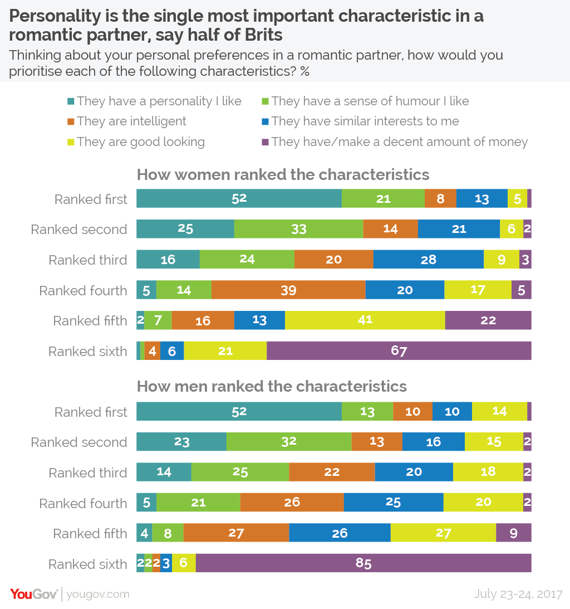

# 2018/W2: Looks vs. Personality

**Data (data.world):** [https://data.world/makeovermonday/2018-w-2-looks-vs-personality](https://data.world/makeovermonday/2018-w-2-looks-vs-personality)

**Article / original viz:** [https://yougov.co.uk/news/2017/11/29/personality-more-important-looks-across-globe/](https://yougov.co.uk/news/2017/11/29/personality-more-important-looks-across-globe/)

**Dataset:** `makeovermonday/2018-w-2-looks-vs-personality`  
**Last updated on data.world:** 2018-01-07T11:11:07.016Z

---

**Across the globe, personality is rated as more important than looks**

# **Original Visualization**

# **About this Dataset**
**SOURCE:** [YouGov](https://yougov.co.uk/news/2017/11/29/personality-more-important-looks-across-globe/) and provided by [Matthew Smith](https://twitter.com/mattsmithetc).

**NOTE:** Tag [@mattsmithetc](https://twitter.com/mattsmithetc) and [@YouGov](https://twitter.com/YouGov) on Twitter in visualisations created. 

# **Objectives**
* What works and what doesn't work with this chart? 
* How can you make it better? 
* Post your alternative on the discussions page.