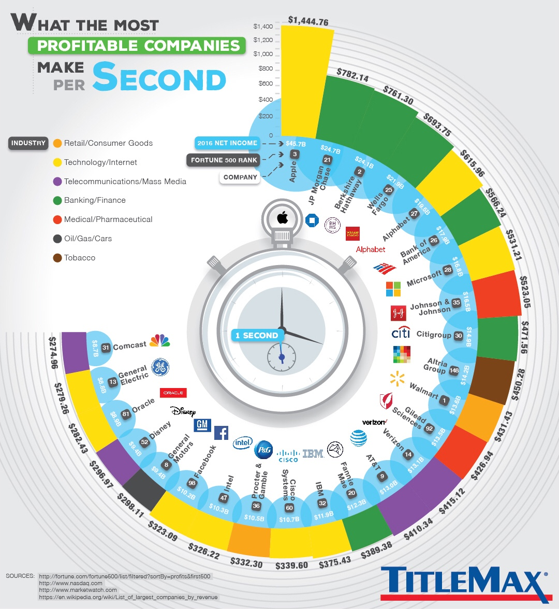

# 2018/W5: What the Most Profitable Companies Make per Second

**Data (data.world):** [https://data.world/makeovermonday/2018-w-5-what-the-most-profitable-companies-make-per-second](https://data.world/makeovermonday/2018-w-5-what-the-most-profitable-companies-make-per-second)

**Article / original viz:** [https://www.titlemax.com/discovery-center/money-finance/most-profitable-companies/](https://www.titlemax.com/discovery-center/money-finance/most-profitable-companies/)

**Dataset:** `makeovermonday/2018-w-5-what-the-most-profitable-companies-make-per-second`  
**Last updated on data.world:** 2018-01-30T15:42:41.670Z

---

What the Most Profitable Companies Make per Second

# **Original Visualization**

# **About this Dataset**
DATA SOURCE: [TitleMax](https://www.titlemax.com/discovery-center/money-finance/most-profitable-companies/)

AUTHOR: [TitleMax](https://twitter.com/titlemax)

# **Objectives**

* What works and what doesn't work with this chart? 
* How can you make it better? 
* Post your alternative on the discussions page.