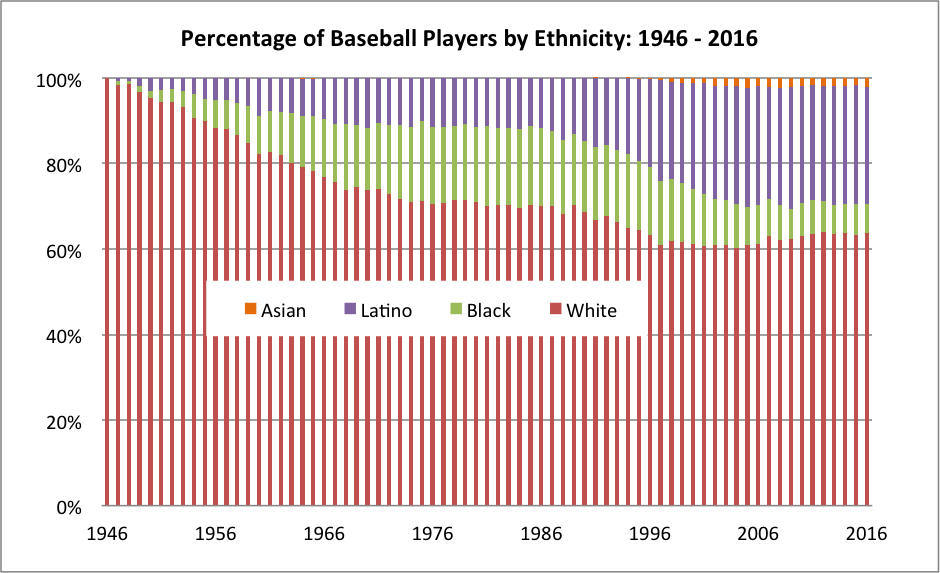

# 2018/W6: Baseball Demographics (1947-2016)

**Data (data.world):** [https://data.world/makeovermonday/2018-w-6-baseball-demographics-1947-2016](https://data.world/makeovermonday/2018-w-6-baseball-demographics-1947-2016)

**Article / original viz:** [https://sabr.org/bioproj/topic/baseball-demographics-1947-2012](https://sabr.org/bioproj/topic/baseball-demographics-1947-2012)

**Dataset:** `makeovermonday/2018-w-6-baseball-demographics-1947-2016`  
**Last updated on data.world:** 2018-02-04T14:11:29.961Z

---

Baseball Demographics (1947-2016)

# **Original Visualization**

# **About this Dataset**
SOURCE: [Society for American Baseball Research](https://sabr.org/bioproj/topic/baseball-demographics-1947-2012)

# **Objectives**

* What works and what doesn't work with this chart? 
* How can you make it better? 
* Post your alternative on the discussions page.