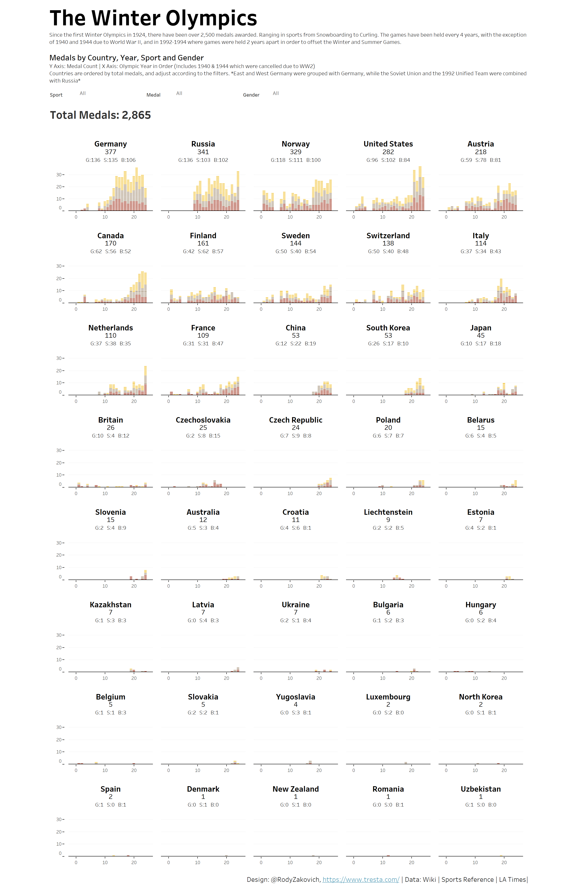

# 2018/W7: The Winter Olympics

**Data (data.world):** [https://data.world/makeovermonday/2018w7-the-winter-olympics](https://data.world/makeovermonday/2018w7-the-winter-olympics)

**Article / original viz:** [https://public.tableau.com/views/TheWinterOlympics/TheWinterOlympics?:embed=y&:showVizHome=no](https://public.tableau.com/views/TheWinterOlympics/TheWinterOlympics?:embed=y&:showVizHome=no)

**Dataset:** `makeovermonday/2018w7-the-winter-olympics`  
**Last updated on data.world:** 2018-02-11T12:57:04.184Z

---

Winter Olympics Medals by Year, Country, Event and Gender

# **Original Visualization**

INTERACTIVE VERSION:
 [Tableau Public](https://public.tableau.com/views/TheWinterOlympics/TheWinterOlympics?:embed=y&:showVizHome=no)

DESIGNED BY: [Rody Zakovich](https://twitter.com/RodyZakovich)

# **About this Dataset**
SOURCE: [Sports-Reference.com](http://Sports-Reference.com)

# **Objectives**

* What works and what doesn't work with this chart? 
* How can you make it better? 
* Post your alternative on the discussions page.