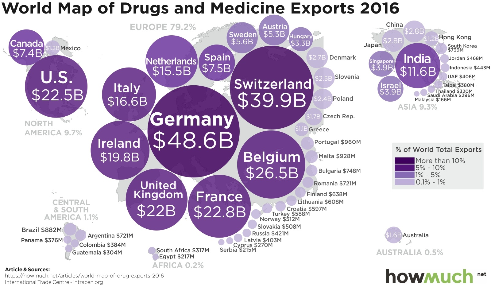

# 2018/W8: Where does your medicine come from?

**Data (data.world):** [https://data.world/makeovermonday/2018w8-where-does-your-medicine-come-from](https://data.world/makeovermonday/2018w8-where-does-your-medicine-come-from)

**Article / original viz:** [https://howmuch.net/articles/world-map-of-drug-exports-2016](https://howmuch.net/articles/world-map-of-drug-exports-2016)

**Dataset:** `makeovermonday/2018w8-where-does-your-medicine-come-from`  
**Last updated on data.world:** 2018-02-18T14:22:36.951Z

---

Where does your medicine come from?

# **Original Visualization**

# **About this Dataset**
SOURCE: [TradeMap](https://www.trademap.org/Country_SelProduct_TS.aspx?nvpm=1|||||3004|||4|1|1|2|2|1|2|1|1)

# **Objectives**

* What works and what doesn't work with this chart? 
* How can you make it better? 
* Post your alternative on the discussions page.