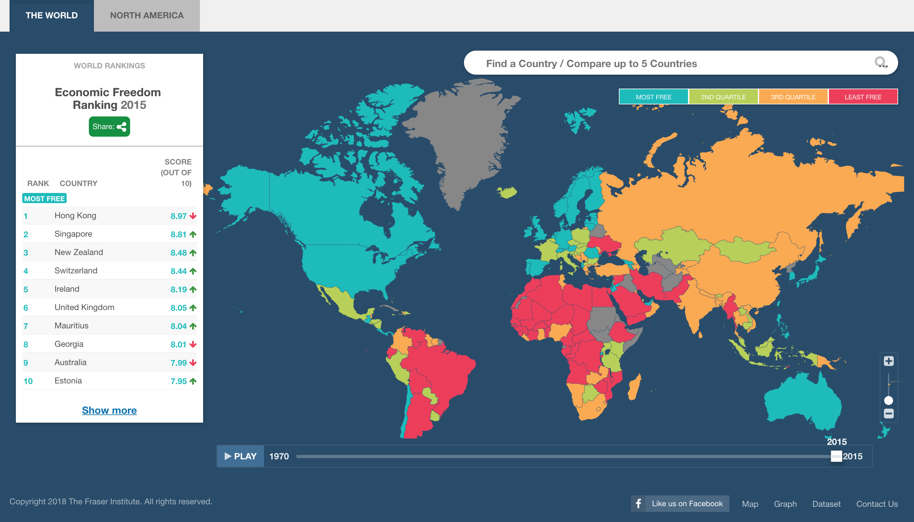

# 2018/W9: World Economic Freedom

**Data (data.world):** [https://data.world/makeovermonday/2018w9-world-economic-freedom](https://data.world/makeovermonday/2018w9-world-economic-freedom)

**Article / original viz:** [https://www.fraserinstitute.org/economic-freedom/map?geozone=world&page=map&year=2007](https://www.fraserinstitute.org/economic-freedom/map?geozone=world&page=map&year=2007)

**Dataset:** `makeovermonday/2018w9-world-economic-freedom`  
**Last updated on data.world:** 2018-02-25T14:23:03.483Z

---

World Economic Freedom: 1970-2015

# **About this Dataset**
SOURCE: [Fraser Institute](https://www.fraserinstitute.org/economic-freedom/dataset)

# **Objectives**

* What works and what doesn't work with this chart? 
* How can you make it better? 
* Post your alternative on the discussions page.