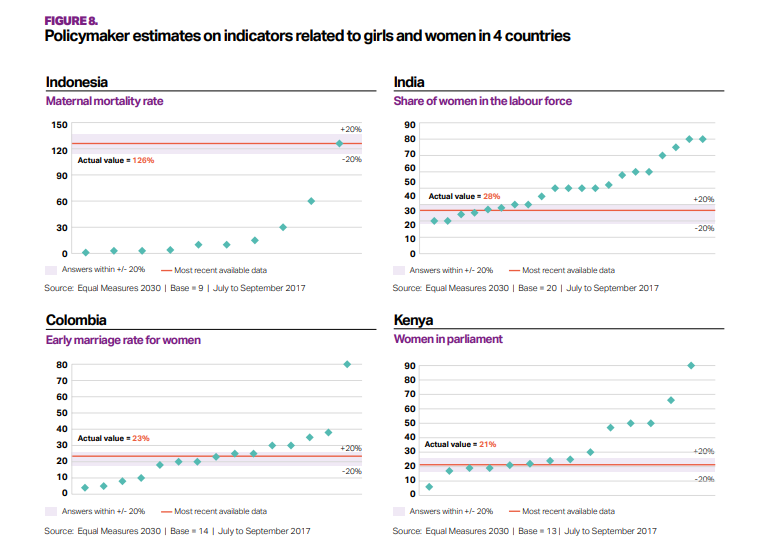

# 2018/W10: What Policymakers know about Women and Girl Issues

**Data (data.world):** [https://data.world/makeovermonday/w102018-what-policymakers-know-about-women-and-girl-issues](https://data.world/makeovermonday/w102018-what-policymakers-know-about-women-and-girl-issues)

**Article / original viz:** [http://www.equalmeasures2030.org/products/policymaker-report/](http://www.equalmeasures2030.org/products/policymaker-report/)

**Dataset:** `makeovermonday/w102018-what-policymakers-know-about-women-and-girl-issues`  
**Last updated on data.world:** 2018-03-04T13:35:15.559Z

---

What Policymakers know about Women and Girl Issues

# **Original Visualization**

# **About this Dataset**
SOURCE: [Equal Measures 2030](http://www.equalmeasures2030.org/products/policymaker-report)

This week's Makeover Monday challenge is a collaboration with Tableau Public and Equal Measures 2030 in celebration of International Women's Day.

The data provided shows the responses by policy makers across a number of countries when asked for their judgement of different issues relating to women in girls in their country.

The data contains a *'correct answer'* with, for example, the rate at which women participate in the labor force. 

Then there is a column with the *guess or estimate* by the policy makers.
For labor participation, a guess that is higher than the correct answer is an overestimation, i.e. people think the situation is better than it is in reality.

For early marriage rates (the percentage of women currently aged 20-24 who were married before reaching the age of 18), an estimate below the correct answer means policy makers are underestimating how frequent these early marriages are.

# **Objectives**

* What works and what doesn't work with this chart? 
* How can you make it better? 
* Post your alternative on the discussions page.