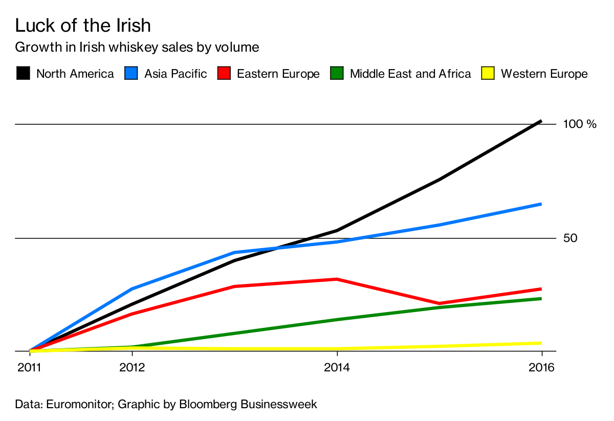

# 2018/W11: Growth in Irish Whiskey Sales

**Data (data.world):** [https://data.world/makeovermonday/2018w11-growth-in-irish-whiskey-sales](https://data.world/makeovermonday/2018w11-growth-in-irish-whiskey-sales)

**Article / original viz:** [https://www.bloomberg.com/news/articles/2017-10-13/irish-whiskey-is-following-scotch-s-high-end-strategy](https://www.bloomberg.com/news/articles/2017-10-13/irish-whiskey-is-following-scotch-s-high-end-strategy)

**Dataset:** `makeovermonday/2018w11-growth-in-irish-whiskey-sales`  
**Last updated on data.world:** 2018-03-11T14:06:09.206Z

---

St. Patrick's Day Special - Growth in Irish Whiskey Sales

# **Original Visualization**

# **About this Dataset**
SOURCE: [Board Bia](https://twitter.com/Bordbia) via [The IWSR](https://twitter.com/TheIWSR)

When you tweet your viz, be sure to tag:
1. [@Bordbia](https://twitter.com/Bordbia)
2. [@TheIWSR](https://twitter.com/TheIWSR)
3. [@GlendaloughDist](https://twitter.com/GlendaloughDist)
4. [@InfoLabIE](https://twitter.com/infolabIE)
5. Include #DataVizKey

# **Contest**

To celebrate St. Patrick’s Day 2018, we’re providing whiskey themed data and our three favorite vizzes from the week will each receive one bottle of double barrel whiskey courtesy of [Glendalough Distillery](http://www.glendaloughdistillery.com/). We’ll pick the winners from the data.world main discussion next **Friday at 3pm GMT**. Be sure to post your vizzes there if you want to be considered.

.jpg)

# **Objectives**

* What works and what doesn't work with this chart? 
* How can you make it better? 
* Post your alternative on the discussions page.