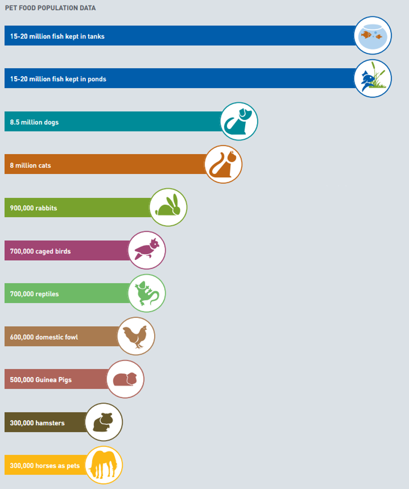

# 2018/W12: UK Pet Population in 2017

**Data (data.world):** [https://data.world/makeovermonday/2018w12-uk-pet-population-in-2017](https://data.world/makeovermonday/2018w12-uk-pet-population-in-2017)

**Article / original viz:** [https://www.pfma.org.uk/_assets/docs/annual-reports/PFMA-Annual-Report-2016.pdf](https://www.pfma.org.uk/_assets/docs/annual-reports/PFMA-Annual-Report-2016.pdf)

**Dataset:** `makeovermonday/2018w12-uk-pet-population-in-2017`  
**Last updated on data.world:** 2018-03-18T10:58:50.787Z

---

UK Pet Population in 2017

# **Original Visualization**

# **About this Dataset**
SOURCE: [Pet Food Manufacturers Association](https://www.pfma.org.uk/pet-population-2017)

[Annual Report 2017, p. 14](https://www.pfma.org.uk/_assets/docs/annual-reports/PFMA-Annual-Report-2016.pdf)

# **Objectives**

* What works and what doesn't work with this chart? 
* How can you make it better? 
* Post your alternative on the discussions page.