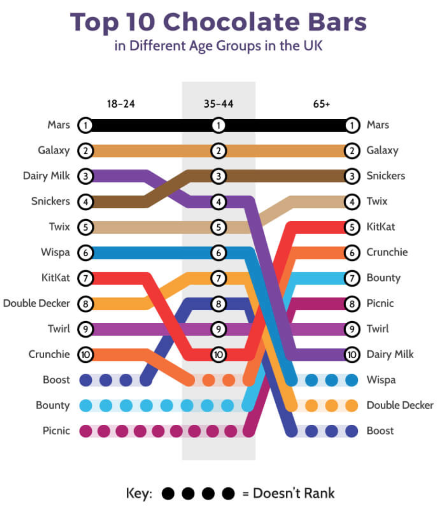

# 2018/W13: What is the UK's favorite chocolate bar?

**Data (data.world):** [https://data.world/makeovermonday/what-is-the-uks-favorite-chocolate-bar](https://data.world/makeovermonday/what-is-the-uks-favorite-chocolate-bar)

**Article / original viz:** [https://www.cda.eu/blog/uks-favourite-chocolate-bar/](https://www.cda.eu/blog/uks-favourite-chocolate-bar/)

**Dataset:** `makeovermonday/what-is-the-uks-favorite-chocolate-bar`  
**Last updated on data.world:** 2018-03-25T09:33:28.113Z

---

What is the UK's favorite chocolate bar?

The Easter Bunny is coming this week, so let's have a great debate! What is the UK's favorite chocolate? 

# **Original Visualization**

# **About this Dataset**
SOURCE: [CDA](https://www.cda.eu/)

# **Objectives**
* What works and what doesn't work with this chart? 
* How can you make it better? 
* Post your alternative on the discussions page.