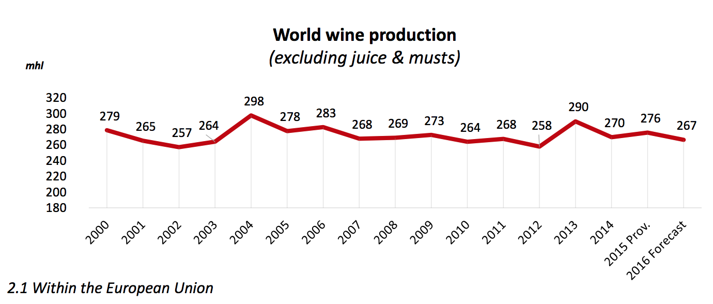

# 2018/W14: World Wine Production

**Data (data.world):** [https://data.world/makeovermonday/2018w14-world-wine-production](https://data.world/makeovermonday/2018w14-world-wine-production)

**Article / original viz:** [http://www.oiv.int/public/medias/5287/oiv-noteconjmars2017-en.pdf](http://www.oiv.int/public/medias/5287/oiv-noteconjmars2017-en.pdf)

**Dataset:** `makeovermonday/2018w14-world-wine-production`  
**Last updated on data.world:** 2018-04-01T20:56:41.867Z

---

World Wine Production

# **Original Visualization**

# **About this Dataset**
SOURCE: [International Organisation of Vine and Wine](http://www.oiv.int/public/medias/5287/oiv-noteconjmars2017-en.pdf)

# **Objectives**

* What works and what doesn't work with this chart? 
* How can you make it better? 
* Post your alternative on the discussions page.