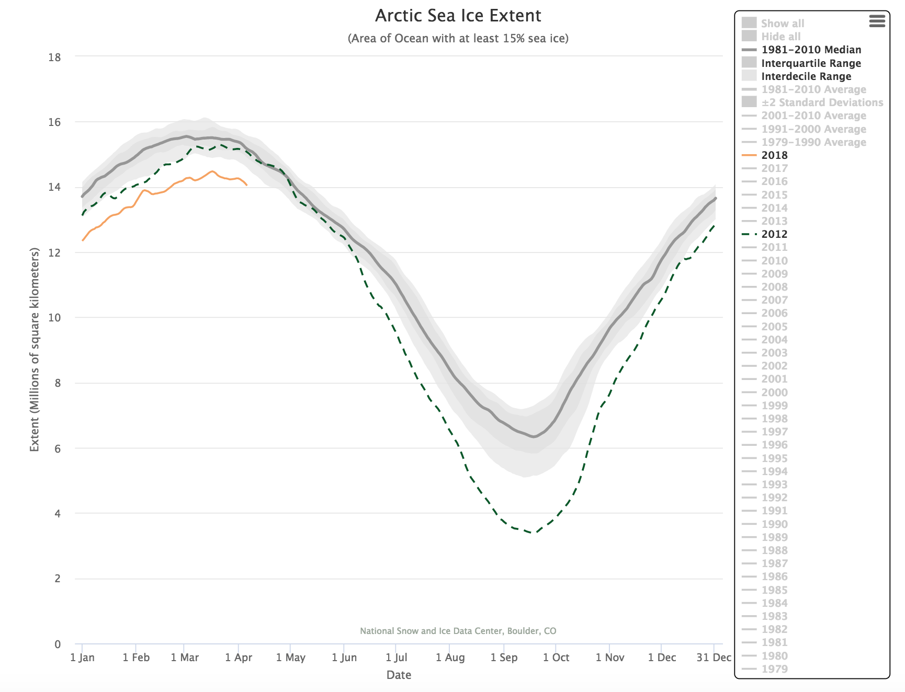

# 2018/W15: Arctic Sea Ice Extent

**Data (data.world):** [https://data.world/makeovermonday/2018w15-arctic-sea-ice-extent](https://data.world/makeovermonday/2018w15-arctic-sea-ice-extent)

**Article / original viz:** [https://nsidc.org/arcticseaicenews/charctic-interactive-sea-ice-graph/](https://nsidc.org/arcticseaicenews/charctic-interactive-sea-ice-graph/)

**Dataset:** `makeovermonday/2018w15-arctic-sea-ice-extent`  
**Last updated on data.world:** 2018-04-08T09:58:08.596Z

---

# **Original Visualization**

# **About this Dataset**
SOURCE: [National Snow & Ice Data Center](https://nsidc.org/)

# **Objectives**
* What works and what doesn't work with this chart? 
* How can you make it better? 
* Post your alternative on the discussions page.