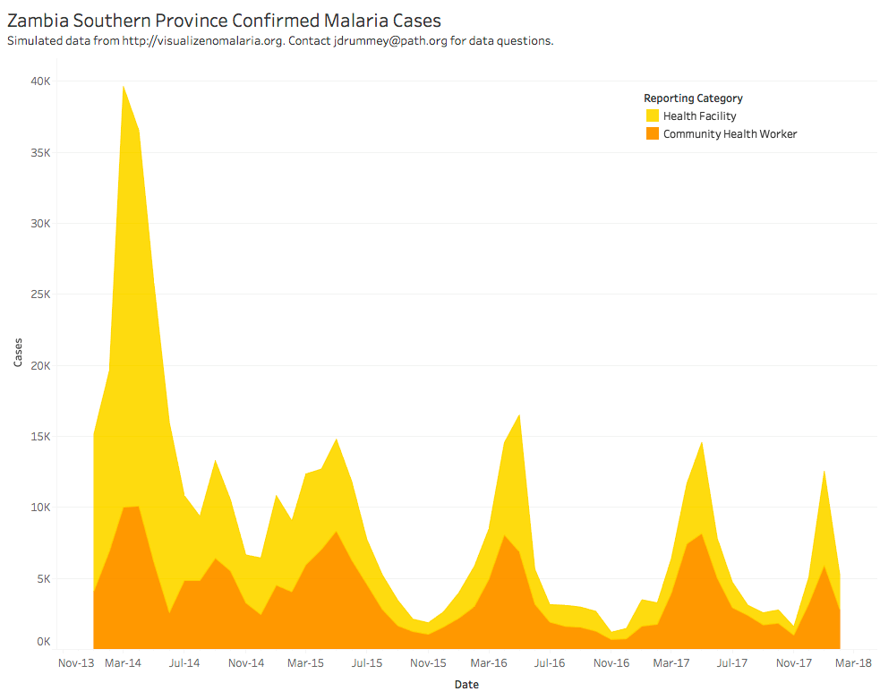

# 2018/W16: Zambia Southern Province Confirmed Malaria Cases

**Data (data.world):** [https://data.world/makeovermonday/2018w16-zambia-southern-province-confirmed-malaria-cases](https://data.world/makeovermonday/2018w16-zambia-southern-province-confirmed-malaria-cases)

**Article / original viz:** [https://data.world/makeovermonday/2018w16-zambia-southern-province-confirmed-malaria-cases](https://data.world/makeovermonday/2018w16-zambia-southern-province-confirmed-malaria-cases)

**Dataset:** `makeovermonday/2018w16-zambia-southern-province-confirmed-malaria-cases`  
**Last updated on data.world:** 2018-04-16T18:20:35.582Z

---

Zambia Southern Province Confirmed Malaria Cases

# **Original Visualization**

[Interactive Version](https://public.tableau.com/profile/jonathan.drummey#!/vizhome/VisualizeNoMalariaMakeoverMonday201804/AreaChart)

# **About this Dataset**
SOURCE: Simulated data from http://visualizenomalaria.org. 
Contact jdrummey@path.org with data questions 
# **Description**
The data is a simulated data set based on actual malaria case counts detected by Zambian Ministry of Health staff who are part of the VisualizeNoMalaria project http://visualizenomalaria.org in Southern Province, Zambia. The data has records for each month for each district in the province broken down by Reporting Category (whether cases were detected by Health Facility staff or Community Health Workers) and Urban/Rural (where the facility or community health workers are located) with a single Count measure.

The chart is a sample view of this data based on a real-world chart used in the Visualize No Malaria project.

The repeating pattern in the data set is coming from the rainy season each year that drives malaria transmission. The decline in the size of the case counts over is due to the persistent efforts of the Zambian Ministry of Health staff and their partners, for more information see http://visualizenomalaria.org and http://makingmalariahistory.org. The counts themselves are not the actual counts, they are simulated.

In the data set is a Disclaimer field with the text “Simulated data from http://visualizenomalaria.org. Contact jdrummey@path.org for data question.”, **please include that text somewhere on your visualization.**

One final note about creating maps on this data if you are using Tableau: Tableau will map the Zambian districts, you’ll need to right-click on the District field and choose Default Properties->Geographic Role->County.

# **Objectives**

* What works and what doesn't work with this chart? 
* How can you make it better? 
* Post your alternative on the discussions page.