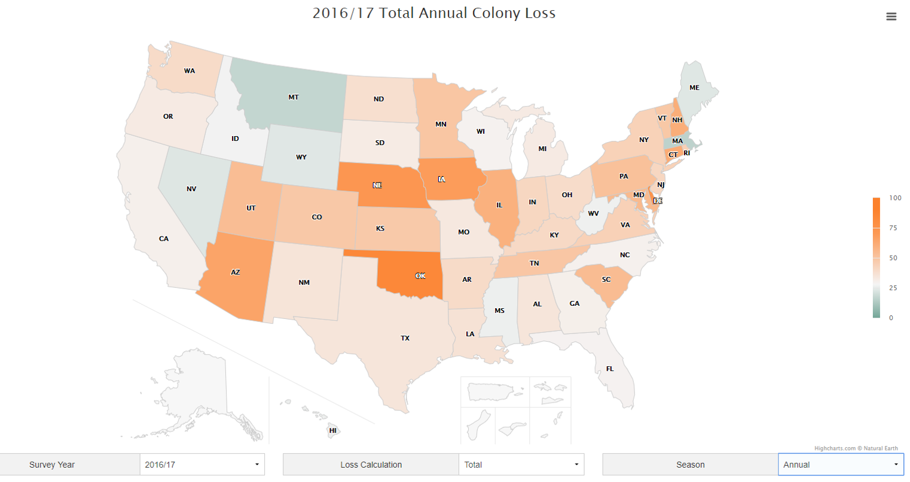

# 2018/W18: Bee Colony Loss

**Data (data.world):** [https://data.world/makeovermonday/2018w18-bee-colony-loss](https://data.world/makeovermonday/2018w18-bee-colony-loss)

**Article / original viz:** [https://bip2.beeinformed.org/loss-map/](https://bip2.beeinformed.org/loss-map/)

**Dataset:** `makeovermonday/2018w18-bee-colony-loss`  
**Last updated on data.world:** 2018-04-29T11:24:34.887Z

---

Bee Colony Loss

# **Original Visualization**

# **About this Dataset**
SOURCE: [Bee Informed](https://bip2.beeinformed.org/loss-map/)

# **Objectives**

* What works and what doesn't work with this chart? 
* How can you make it better? 
* Post your alternative on the discussions page.

# **Notes**

* Slight variations, resulting from additional analyses, may occur between reported losses in publications and those shown on this map.
* Responses for beekeepers that manage colonies in more than one state are included in the loss calculation for each state they keep bees in.
* Percent of beekeepers exclusive to the state indicates the percent of responding beekeepers who do NOT keep bees in other states in addition to the state indicated here.
* "Average loss" represents the average level of loss experienced by a beekeeper in its operation in the selected state. "Total loss" is the estimate of the number of colonies lost by the whole beekeeping population in that state.
* For the protection of privacy, losses are reported as N/A if 5 or fewer beekeepers responded in that state. These beekeepers losses are included in the national statistics.