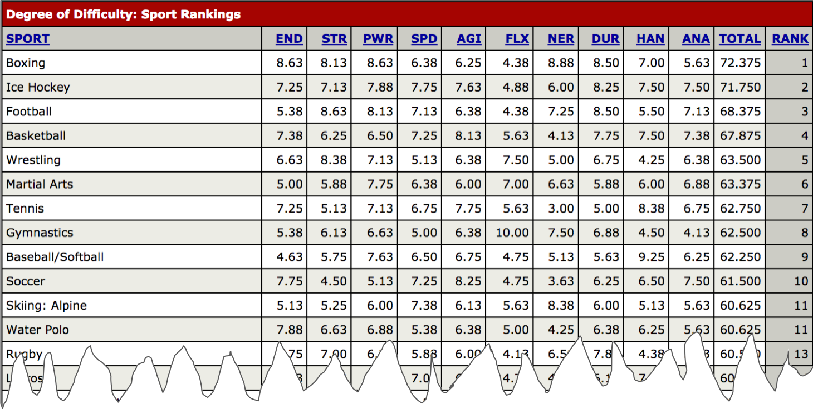

# 2018/W19: Toughest Sport by Skill

**Data (data.world):** [https://data.world/makeovermonday/2018w19-toughest-sport-by-skill](https://data.world/makeovermonday/2018w19-toughest-sport-by-skill)

**Article / original viz:** [http://www.espn.com/espn/page2/sportSkills](http://www.espn.com/espn/page2/sportSkills)

**Dataset:** `makeovermonday/2018w19-toughest-sport-by-skill`  
**Last updated on data.world:** 2018-05-06T07:38:24.475Z

---

Toughest Sport by Skill

# **Original Visualization**

# **About this Dataset**
SOURCE: [ESPN](http://www.espn.com/espn/page2/sportSkills)

# **Objectives**
* What works and what doesn't work with this chart? 
* How can you make it better? 
* Post your alternative on the discussions page.