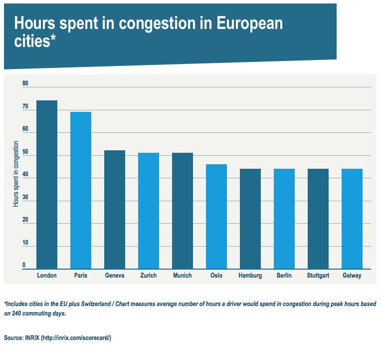

# 2018/W20: Hours spent in Congestion in European Cities

**Data (data.world):** [https://data.world/makeovermonday/2018w20-hours-spent-in-congestion-in-european-cities](https://data.world/makeovermonday/2018w20-hours-spent-in-congestion-in-european-cities)

**Article / original viz:** [http://www.euronews.com/2018/02/07/which-european-commuters-spend-the-most-time-in-traffic-jams-](http://www.euronews.com/2018/02/07/which-european-commuters-spend-the-most-time-in-traffic-jams-)

**Dataset:** `makeovermonday/2018w20-hours-spent-in-congestion-in-european-cities`  
**Last updated on data.world:** 2018-05-13T04:25:59.799Z

---

Hours spent in Congestion in European Cities

# **Original Visualization**

# **About this Dataset**
SOURCE: [EuroNews](http://www.euronews.com/2018/02/07/which-european-commuters-spend-the-most-time-in-traffic-jams-)

# **Objectives**

* What works and what doesn't work with this chart? 
* How can you make it better? 
* Post your alternative on the discussions page.