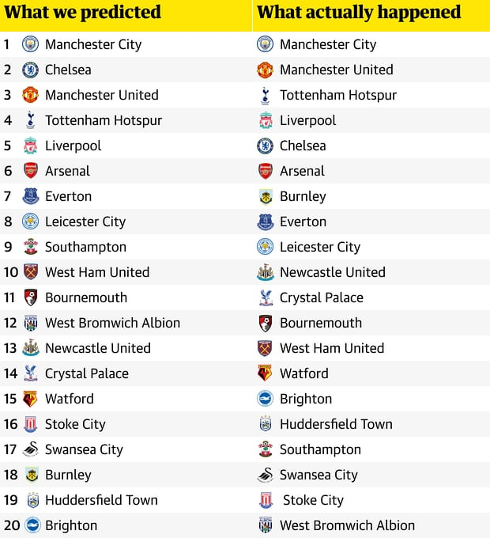

# 2018/W21: Premier League Predictions vs. Reality

**Data (data.world):** [https://data.world/makeovermonday/2018w21-premier-league-predictions-vs-reality](https://data.world/makeovermonday/2018w21-premier-league-predictions-vs-reality)

**Article / original viz:** [https://amp.theguardian.com/football/2018/may/15/premier-league-2017-18-season-predictions-versus-reality](https://amp.theguardian.com/football/2018/may/15/premier-league-2017-18-season-predictions-versus-reality)

**Dataset:** `makeovermonday/2018w21-premier-league-predictions-vs-reality`  
**Last updated on data.world:** 2018-05-20T09:06:59.533Z

---

Premier League Predictions vs. Reality

# **Original Visualization**

# **About this Dataset**
SOURCE: [The Guardian](https://amp.theguardian.com/football/2018/may/15/premier-league-2017-18-season-predictions-versus-reality)

# **Objectives**

* What works and what doesn't work with this chart? 
* How can you make it better? 
* Post your alternative on the discussions page.