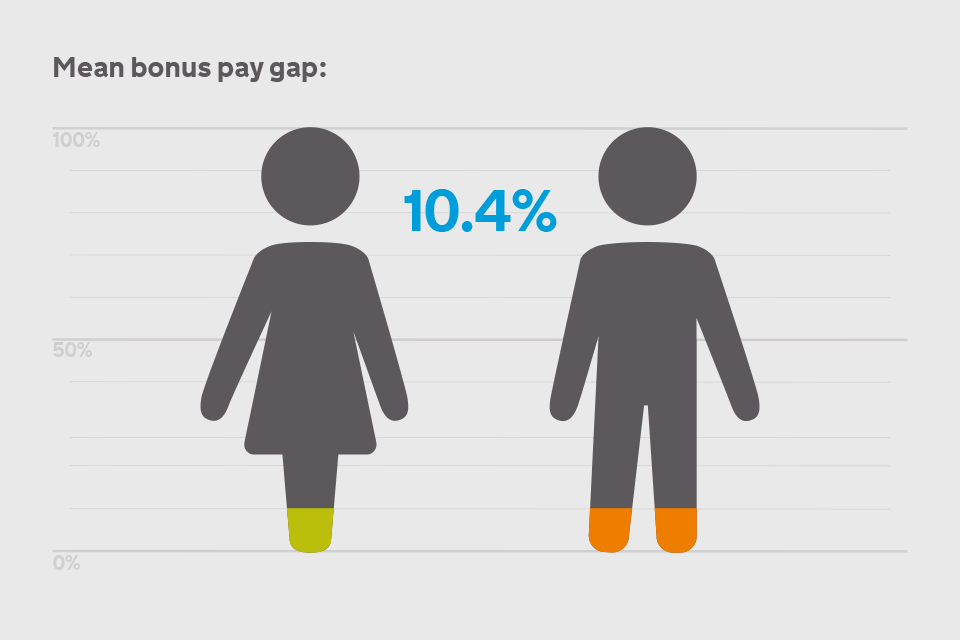
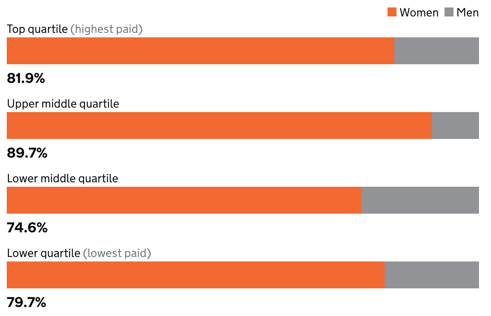

# 2018/W23: U.K. Gender Pay Gap

**Data (data.world):** [https://data.world/makeovermonday/2018w23-uk-gender-pay-gap](https://data.world/makeovermonday/2018w23-uk-gender-pay-gap)

**Article / original viz:** [https://www.gov.uk/government/publications/hmrc-and-voa-gender-pay-gap-report-and-data-2017/hm-revenue-and-customs-gender-pay-gap-report-2017](https://www.gov.uk/government/publications/hmrc-and-voa-gender-pay-gap-report-and-data-2017/hm-revenue-and-customs-gender-pay-gap-report-2017)

**Original data source:** [https://www.gov.uk/report-gender-pay-gap-data](https://www.gov.uk/report-gender-pay-gap-data)

**Dataset:** `makeovermonday/2018w23-uk-gender-pay-gap`  
**Last updated on data.world:** 2018-06-04T10:44:04.864Z

---

U.K. Gender Pay Gap

# **Original Visualization**

# **About this Dataset**
SOURCE: [GOV.UK](https://www.gov.uk/government/publications/hmrc-and-voa-gender-pay-gap-report-and-data-2017/hm-revenue-and-customs-gender-pay-gap-report-2017)

Please use the #genderpaygap hashtag when you post on Twitter. Also tag @govuk @voagovuk and @aislingroberts.

# **Objectives**

* What works and what doesn't work with this chart? 
* How can you make it better? 
* Post your alternative on the discussions page.

# **Notes & Explanations**
## Difference in hourly rate
The mean hourly rate is the average hourly wage across the entire organization so the mean gender pay gap is a measure of the difference between women’s mean hourly wage and men’s mean hourly wage.

For example, if the mean is positive, then women are paid less than men by the percentage listed.

The median hourly rate is calculated by ranking all employees from the highest paid to the lowest paid, and taking the hourly wage of the person in the middle; so the median gender pay gap is the difference between women’s median hourly wage (the middle paid woman) and men’s median hourly wage (the middle paid man).

For example, if the median is positive, then women are paid less than men by the percentage listed.

## Proportion of women in each pay quartile
Pay quartiles are calculated by splitting all employees in an organisation into four even groups according to their level of pay. Looking at the proportion of women in each quartile gives an indication of women's representation at different levels of the organisation.

## Company Lookup
Find any company at https://gender-pay-gap.service.gov.uk/. 

## Example
As an example, consider [Red Band Chemical Company](https://gender-pay-gap.service.gov.uk/viewing/employer-details?e=zfHBmPVe7y86yXwqcStdLg%21%21).

Difference in hourly rate
Women’s mean hourly rate is 2.3% lower than men’s
In other words when comparing mean hourly rates, women earn 98p for every £1 that men earn.

Women’s median hourly rate is 2.7% higher than men’s
In other words when comparing median hourly rates, women earn £1.03 for every £1 that men earn.

Proportion of women in each pay quartile

Who received bonus pay
66.7% of women
15.6% of men
Difference in bonus pay
Women’s mean bonus pay is 15% lower than men’s
Women’s median bonus pay is 37.5% lower than men’s