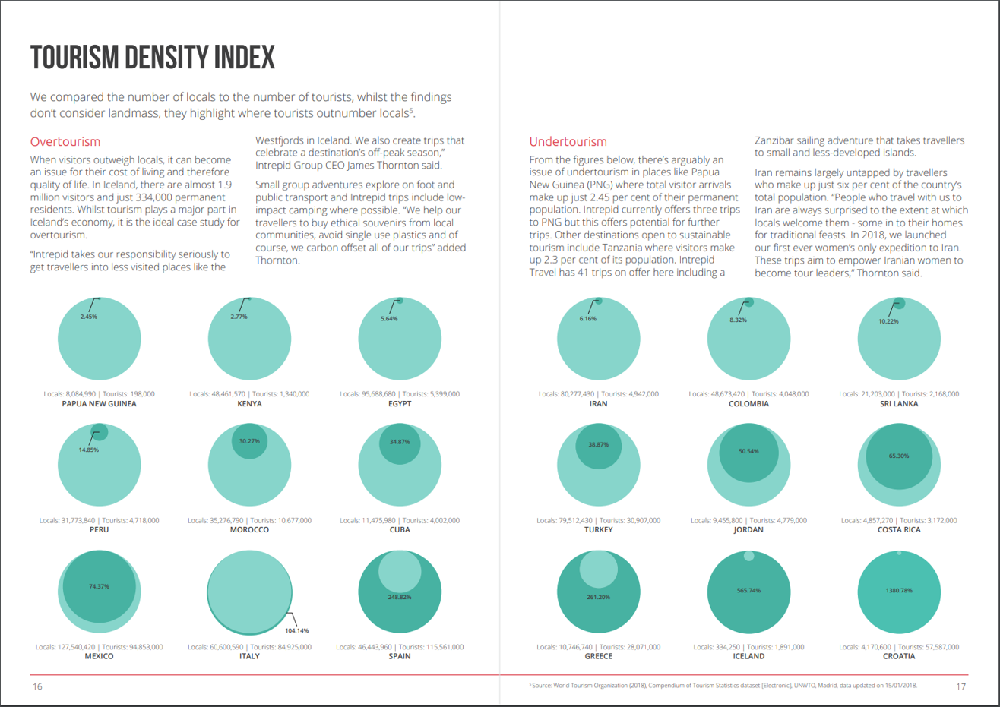

# 2018/W24: Tourism Density Index

**Data (data.world):** [https://data.world/makeovermonday/2018w24-tourism-density-index](https://data.world/makeovermonday/2018w24-tourism-density-index)

**Article / original viz:** [https://www.intrepidtravel.com/au/adventure-index](https://www.intrepidtravel.com/au/adventure-index)

**Original data source:** [https://intrepidgroup.bynder.com/transfer/bdd0abcac448329ed4c9057327b6ca660742e4b5ea16f18bd5a343b2c6d0d0c8](https://intrepidgroup.bynder.com/transfer/bdd0abcac448329ed4c9057327b6ca660742e4b5ea16f18bd5a343b2c6d0d0c8)

**Dataset:** `makeovermonday/2018w24-tourism-density-index`  
**Last updated on data.world:** 2018-06-10T09:53:06.049Z

---

# **Original Visualization**

# **About this Dataset**
SOURCE: [Intrepid Travel](https://intrepidgroup.bynder.com/transfer/bdd0abcac448329ed4c9057327b6ca660742e4b5ea16f18bd5a343b2c6d0d0c8)

# **Objectives**

* What works and what doesn't work with this chart? 
* How can you make it better? 
* Post your alternative on the discussions page.