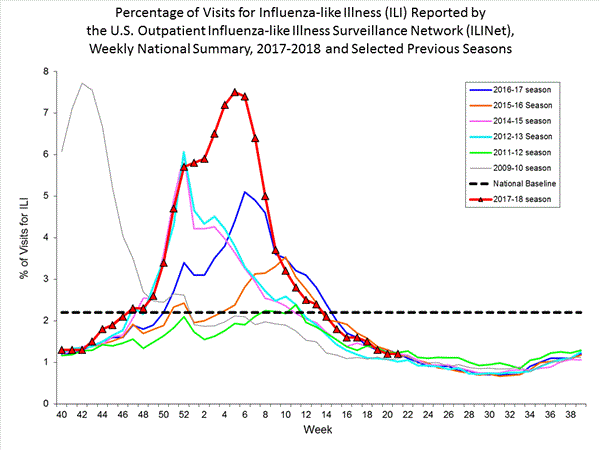

# 2018/W25: U.S. Influenza Surveillance Report

**Data (data.world):** [https://data.world/makeovermonday/us-influenza-surveillance-report](https://data.world/makeovermonday/us-influenza-surveillance-report)

**Article / original viz:** [https://www.cdc.gov/flu/weekly/#S11](https://www.cdc.gov/flu/weekly/#S11)

**Original data source:** [https://gis.cdc.gov/grasp/fluview/fluportaldashboard.html](https://gis.cdc.gov/grasp/fluview/fluportaldashboard.html)

**Dataset:** `makeovermonday/us-influenza-surveillance-report`  
**Last updated on data.world:** 2018-06-17T13:45:16.195Z

---

U.S. Influenza Surveillance Report

# **Original Visualization**

# **About this Dataset**
SOURCE: [CDC](https://gis.cdc.gov/grasp/fluview/fluportaldashboard.html)

# **Objectives**

* What works and what doesn't work with this chart? 
* How can you make it better? 
* Post your alternative on the discussions page.

# **Notes**
1. Data as of 5 June 2018
2. Data at the national level - Regional and State level data is available [here](https://gis.cdc.gov/grasp/fluview/fluportaldashboard.html)