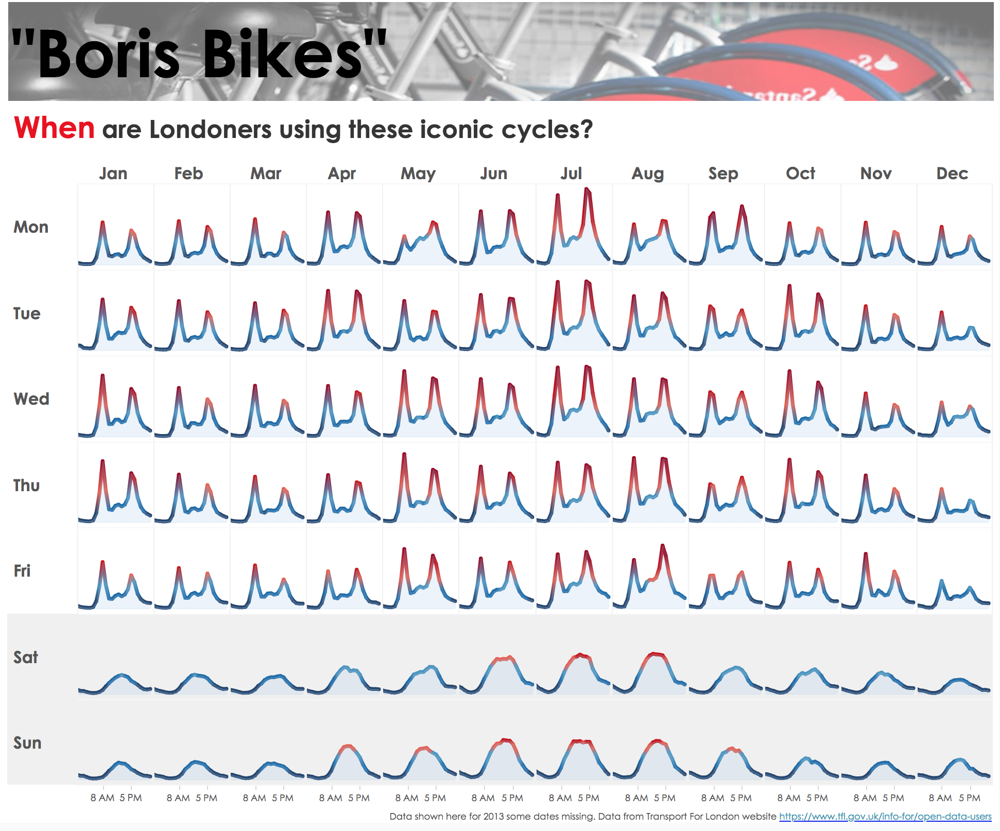

# 2018/W26: London Cycle Hire Usage

**Data (data.world):** [https://data.world/makeovermonday/london-cycle-hire-usage](https://data.world/makeovermonday/london-cycle-hire-usage)

**Article / original viz:** [https://public.tableau.com/en-us/s/gallery/boris-bikes-daily-usage](https://public.tableau.com/en-us/s/gallery/boris-bikes-daily-usage)

**Original data source:** [http://cycling.data.tfl.gov.uk/](http://cycling.data.tfl.gov.uk/)

**Dataset:** `makeovermonday/london-cycle-hire-usage`  
**Last updated on data.world:** 2018-06-24T10:49:28.499Z

---

London Cycle Hire Usage

# **About this Dataset**
* DATA SOURCE: [Transport for London](http://cycling.data.tfl.gov.uk/)
* DESIGNER: [Sophie Sparks](https://twitter.com/sophie_sparkes)
* INTERACTIVE VERSION: [Tableau Public](https://public.tableau.com/en-us/s/gallery/boris-bikes-daily-usage)

# **NOTES**
1. To connect to Exasol data source (50M+ records from 2012-2018) use the Tableau Data Source [here](https://fileshare.theinformationlab.co.uk/index.php/s/8xVZze3BZnjl1oh).
2. Details for connecting to Exasol can be found in [this blog post](http://www.makeovermonday.co.uk/big-data/).
3. If you have trouble downloading the CSV from data.world, you can download it [here](https://fileshare.theinformationlab.co.uk/index.php/s/lJwnY5V2I8Frali) instead. 
4. The CSV only contains data for 2017.

# **Objectives**

* What works and what doesn't work with this chart? 
* How can you make it better? 
* Post your alternative on the discussions page.