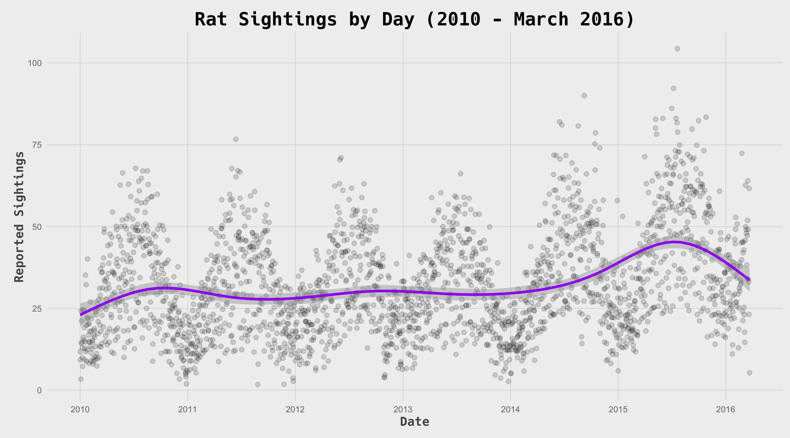

# 2018/W27: Rat Sightings in New York City

**Data (data.world):** [https://data.world/makeovermonday/2018w27-rat-sightings-in-new-york-city](https://data.world/makeovermonday/2018w27-rat-sightings-in-new-york-city)

**Article / original viz:** [https://www.jowanza.com/blog/rat-sightings-in-new-york-city-revisited](https://www.jowanza.com/blog/rat-sightings-in-new-york-city-revisited)

**Original data source:** [https://nycopendata.socrata.com/Social-Services/Rat-Sightings/3q43-55fe/data](https://nycopendata.socrata.com/Social-Services/Rat-Sightings/3q43-55fe/data)

**Dataset:** `makeovermonday/2018w27-rat-sightings-in-new-york-city`  
**Last updated on data.world:** 2018-07-01T17:24:01.540Z

---

Rat Sightings in New York City

# **Original Visualization**

CREATED BY: [Jowanza Joseph](https://twitter.com/Jowanza)

SOURCE ARTICLE: [Link](https://www.jowanza.com/blog/rat-sightings-in-new-york-city-revisited)

# **About this Dataset**

DATA SOURCE: [NYC Open Data](https://nycopendata.socrata.com/Social-Services/Rat-Sightings/3q43-55fe/data)

# **Objectives**

* What works and what doesn't work with this chart? 
* How can you make it better? 
* Post your alternative on the discussions page.