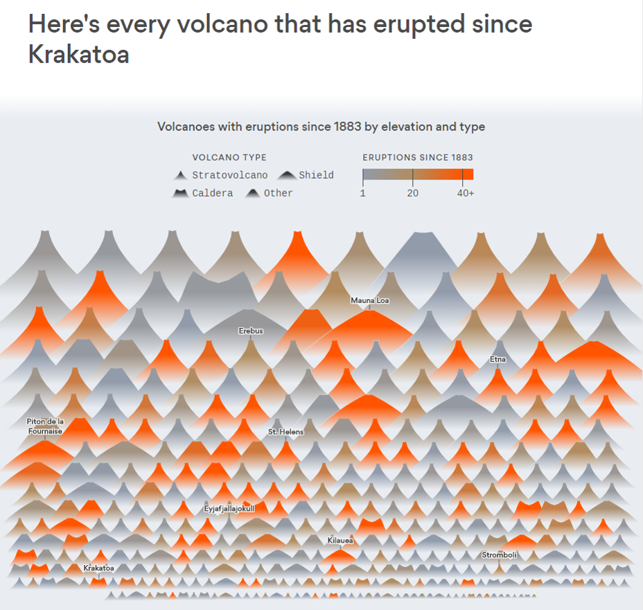

# 2018/W28: Volcano Eruptions

**Data (data.world):** [https://data.world/makeovermonday/2018w28-volcano-eruptions](https://data.world/makeovermonday/2018w28-volcano-eruptions)

**Article / original viz:** [https://www.axios.com/chart-every-volcano-that-erupted-since-krakatoa-467da621-41ba-4efc-99c6-34ff3cb27709.html](https://www.axios.com/chart-every-volcano-that-erupted-since-krakatoa-467da621-41ba-4efc-99c6-34ff3cb27709.html)

**Original data source:** [https://volcano.si.edu/list_volcano_holocene.cfm](https://volcano.si.edu/list_volcano_holocene.cfm)

**Dataset:** `makeovermonday/2018w28-volcano-eruptions`  
**Last updated on data.world:** 2018-07-08T10:57:45.161Z

---

Volcano Eruptions

# **Original Visualization**

# **About this Dataset**
SOURCE: [Global Volcanism Program](https://volcano.si.edu/list_volcano_holocene.cfm)

# **Objectives**

* What works and what doesn't work with this chart? 
* How can you make it better? 
* Post your alternative on the discussions page.