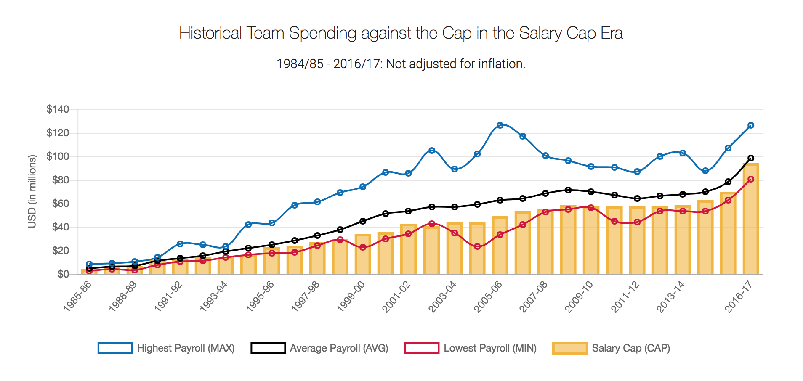

# 2018/W29: Historical NBA Team Spending Against the Cap

**Data (data.world):** [https://data.world/makeovermonday/2018w29-historical-nba-team-spending-against-the-cap](https://data.world/makeovermonday/2018w29-historical-nba-team-spending-against-the-cap)

**Article / original viz:** [https://www.whatsthecap.com/nba/salary-cap/](https://www.whatsthecap.com/nba/salary-cap/)

**Original data source:** [http://www.celticshub.com/2017/12/07/nba-player-salaries-1991-2017/](http://www.celticshub.com/2017/12/07/nba-player-salaries-1991-2017/)

**Dataset:** `makeovermonday/2018w29-historical-nba-team-spending-against-the-cap`  
**Last updated on data.world:** 2018-07-15T16:37:48.395Z

---

Historical NBA Team Spending Against the Cap in the Salary Cap Era

# **Original Visualization**

SOURCE: [What's the Cap?](https://www.whatsthecap.com/nba/salary-cap/)  |  [@whatsthecap](https://twitter.com/whatsthecap)

# **About this Dataset**
DATA SOURCE: [Celtics Hub](http://www.celticshub.com/2017/12/07/nba-player-salaries-1991-2017/)  |  [@CelticsHub](https://twitter.com/CelticsHub)

# **Objectives**
* What works and what doesn't work with this chart? 
* How can you make it better? 
* Post your alternative on the discussions page.