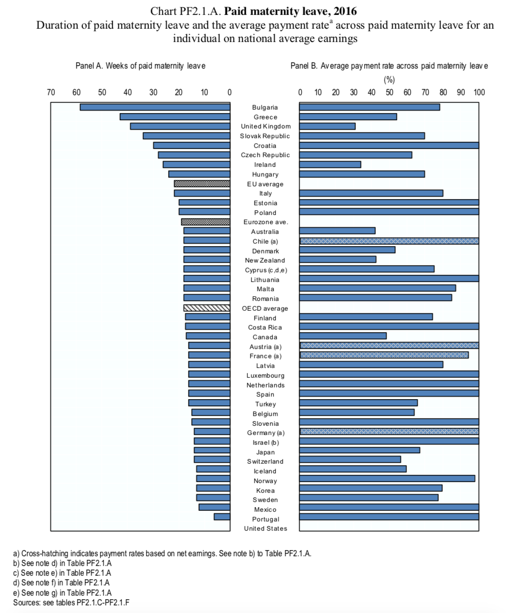

# 2018/W30: Parental leave in the OECD

**Data (data.world):** [https://data.world/makeovermonday/2018w30-parental-leave-in-the-oecd](https://data.world/makeovermonday/2018w30-parental-leave-in-the-oecd)

**Article / original viz:** [https://www.oecd.org/els/soc/PF2_1_Parental_leave_systems.pdf](https://www.oecd.org/els/soc/PF2_1_Parental_leave_systems.pdf)

**Original data source:** [https://www.oecd.org/els/soc/PF2_1_Parental_leave_systems.pdf](https://www.oecd.org/els/soc/PF2_1_Parental_leave_systems.pdf)

**Dataset:** `makeovermonday/2018w30-parental-leave-in-the-oecd`  
**Last updated on data.world:** 2018-07-22T10:50:02.699Z

---

Parental leave in the OECD

# **Original Visualization**

# **About this Dataset**
SOURCE: [OECD](https://www.oecd.org/els/soc/PF2_1_Parental_leave_systems.pdf)

# **Objectives**

* What works and what doesn't work with this chart? 
* How can you make it better? 
* Post your alternative on the discussions page.