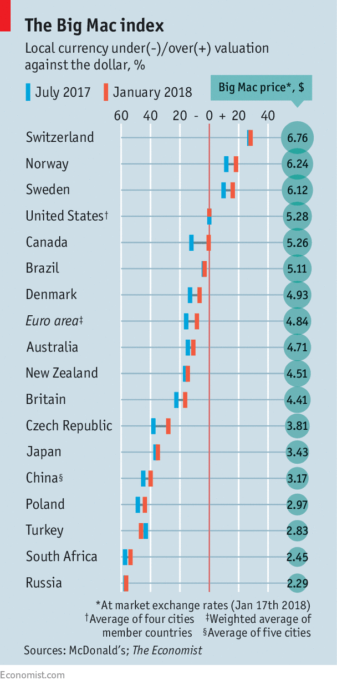

# 2018/W31: Big Mac Index

**Data (data.world):** [https://data.world/makeovermonday/2018w31-big-mac-index](https://data.world/makeovermonday/2018w31-big-mac-index)

**Article / original viz:** [https://www.economist.com/bigmac](https://www.economist.com/bigmac)

**Original data source:** [https://github.com/TheEconomist/big-mac-data/tree/master/output-data](https://github.com/TheEconomist/big-mac-data/tree/master/output-data)

**Dataset:** `makeovermonday/2018w31-big-mac-index`  
**Last updated on data.world:** 2018-07-29T15:07:41.328Z

---

The Economist Big Mac Index

# **Original Visualization**

# **About this Dataset**
SOURCE: [The Economist](https://www.economist.com/finance-and-economics/2018/01/20/our-big-mac-index-shows-fundamentals-now-matter-more-in-currency-markets)

More information about how the index is calculated, where exchange rates came from, etc. available on [github](https://github.com/TheEconomist/big-mac-data).

# **Objectives**

* What works and what doesn't work with this chart? 
* How can you make it better? 
* Post your alternative on the discussions page.