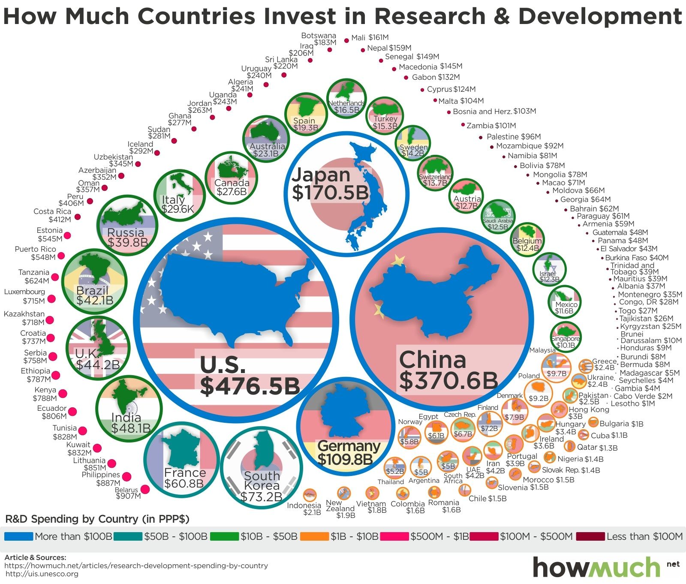

# 2018/W32: What Countries Spend on Research & Development

**Data (data.world):** [https://data.world/makeovermonday/2018w32-what-countries-spend-on-research-development](https://data.world/makeovermonday/2018w32-what-countries-spend-on-research-development)

**Article / original viz:** [https://howmuch.net/articles/research-development-spending-by-country](https://howmuch.net/articles/research-development-spending-by-country)

**Original data source:** [http://data.uis.unesco.org/Index.aspx?DataSetCode=SCN_DS](http://data.uis.unesco.org/Index.aspx?DataSetCode=SCN_DS)

**Dataset:** `makeovermonday/2018w32-what-countries-spend-on-research-development`  
**Last updated on data.world:** 2018-08-06T07:16:13.296Z

---

What Countries Spend on Research & Development

# **Original Visualization**

# **About this Dataset**
ARTICLE: [How Much?](https://howmuch.net/articles/research-development-spending-by-country)

additional information on this [UNESCO page](http://uis.unesco.org/apps/visualisations/research-and-development-spending/)

SOURCE: [UNESCO Institute for Statistics](http://data.uis.unesco.org/Index.aspx?DataSetCode=SCN_DS)

Note: To recreate the original numbers, you need to use year 2014.

# **Objectives**

* What works and what doesn't work with this chart? 
* How can you make it better? 
* Post your alternative on the discussions page.