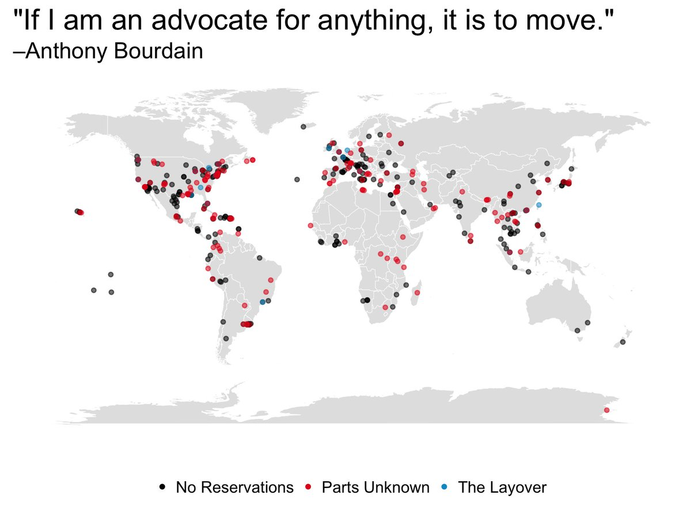

# 2018/W33: Anthony Bourdain’s Travels

**Data (data.world):** [https://data.world/makeovermonday/2018w33-anthony-bourdains-travels](https://data.world/makeovermonday/2018w33-anthony-bourdains-travels)

**Article / original viz:** [https://twitter.com/christinezhang/status/1005974583206449152](https://twitter.com/christinezhang/status/1005974583206449152)

**Original data source:** [https://twitter.com/christinezhang](https://twitter.com/christinezhang)

**Dataset:** `makeovermonday/2018w33-anthony-bourdains-travels`  
**Last updated on data.world:** 2018-08-12T15:10:53.865Z

---

Anthony Bourdain’s Travels

# **Original Visualization**

# **About this Dataset**
* IMAGE SOURCE: [Christine Zhang (Twitter)](https://twitter.com/christinezhang/status/1005974583206449152)
* DATA SOURCE: [Christine Zhang (Github)](https://t.co/vS7TIWUcQa)

# **Objectives**
* What works and what doesn't work with this chart? 
* How can you make it better? 
* Post your alternative on the discussions page.