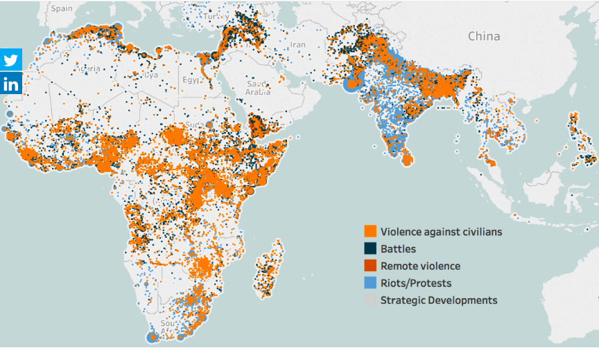

# 2018/W34: ACLED: Visualizing Conflict

**Data (data.world):** [https://data.world/makeovermonday/2018w34-visualizing-conflict](https://data.world/makeovermonday/2018w34-visualizing-conflict)

**Article / original viz:** [https://www.acleddata.com/dashboard/](https://www.acleddata.com/dashboard/)

**Original data source:** [https://www.acleddata.com/data/](https://www.acleddata.com/data/)

**Dataset:** `makeovermonday/2018w34-visualizing-conflict`  
**Last updated on data.world:** 2018-08-19T09:08:13.683Z

---

ACLED: Visualizing Conflict

# **Original Visualization**

# **About this Dataset**
SOURCE: [ACLED](https://www.acleddata.com/dashboard/)

Data Source: [DATA](https://www.acleddata.com/data/)

Note: Please include the hashtage #ACLEDconflictviz on Twitter

# **Objectives**

* What works and what doesn't work with this chart? 
* How can you make it better? 
* Post your alternative on the discussions page.