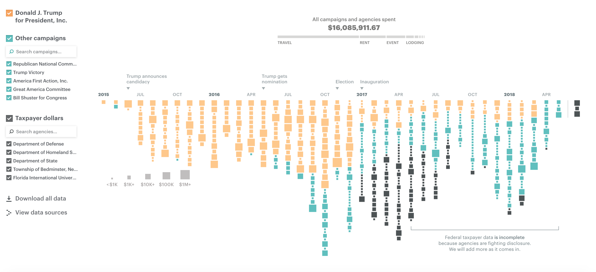

# 2018/W37: Paying the President

**Data (data.world):** [https://data.world/makeovermonday/2018w37-paying-the-president](https://data.world/makeovermonday/2018w37-paying-the-president)

**Article / original viz:** [https://projects.propublica.org/paying-the-president/](https://projects.propublica.org/paying-the-president/)

**Original data source:** [https://www.propublica.org/datastore/dataset/spending-at-trump-properties](https://www.propublica.org/datastore/dataset/spending-at-trump-properties)

**Dataset:** `makeovermonday/2018w37-paying-the-president`  
**Last updated on data.world:** 2018-09-09T12:42:31.436Z

---

Spending at Trump properties by ProPublica - Collaboration with #WorkoutWednesday

# **Original Visualization**

ORIGINAL ARTICLE: [ProPublica](https://projects.propublica.org/paying-the-president/)

# **About this Dataset**
DATA SOURCE: [ProPublica](https://www.propublica.org/datastore/dataset/spending-at-trump-properties)

# **Objectives**
* What works and what doesn't work with this chart? 
* How can you make it better? 
* Post your alternative on the discussions page.