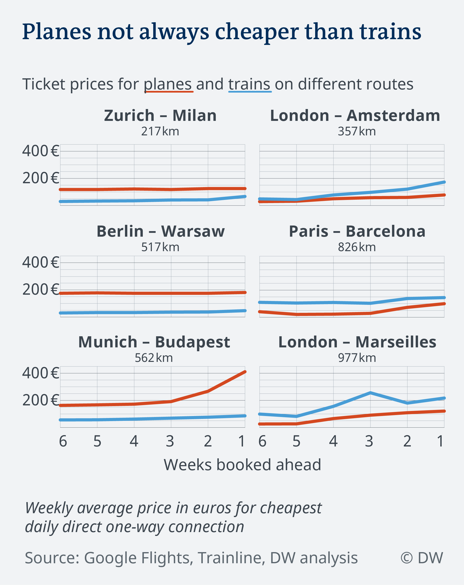

# 2018/W38: Trains vs. planes: What's the real cost of travel?

**Data (data.world):** [https://data.world/makeovermonday/2018w38-trains-vs-planes-whats-the-real-cost-of-travel](https://data.world/makeovermonday/2018w38-trains-vs-planes-whats-the-real-cost-of-travel)

**Article / original viz:** [https://www.dw.com/en/trains-vs-planes-whats-the-real-cost-of-travel/a-45209552](https://www.dw.com/en/trains-vs-planes-whats-the-real-cost-of-travel/a-45209552)

**Original data source:** [https://github.com/dw-data/travel-cost](https://github.com/dw-data/travel-cost)

**Dataset:** `makeovermonday/2018w38-trains-vs-planes-whats-the-real-cost-of-travel`  
**Last updated on data.world:** 2018-09-16T12:14:01.080Z

---

Trains vs. planes: What's the real cost of travel?

# **Original Visualization**

# **About this Dataset**
Article: [Deutsche Welle](https://www.dw.com/en/trains-vs-planes-whats-the-real-cost-of-travel/a-45209552)

Data Source: [DW Data](https://github.com/dw-data/travel-cost)

# **Objectives**

* What works and what doesn't work with this chart? 
* How can you make it better? 
* Post your alternative on the discussions page.