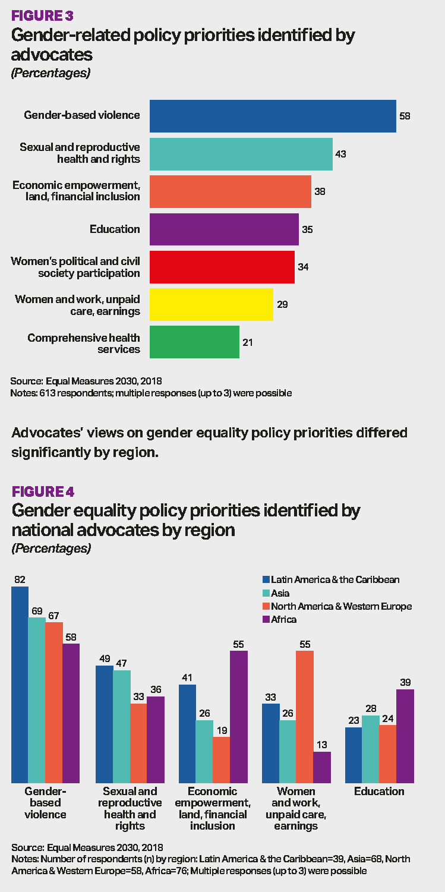

# 2018/W39: Visualizing Equality

**Data (data.world):** [https://data.world/makeovermonday/2018w39-visualizing-equality](https://data.world/makeovermonday/2018w39-visualizing-equality)

**Article / original viz:** [https://data.world/makeovermonday/2018w39-visualizing-equality/file/Insert_AdvocatesSurvey_EM2030.pdf](https://data.world/makeovermonday/2018w39-visualizing-equality/file/Insert_AdvocatesSurvey_EM2030.pdf)

**Original data source:** [http://data.em2030.org/wp-content/uploads/2018/09/EM2030-2018-Global-Report.pdf](http://data.em2030.org/wp-content/uploads/2018/09/EM2030-2018-Global-Report.pdf)

**Dataset:** `makeovermonday/2018w39-visualizing-equality`  
**Last updated on data.world:** 2018-09-23T07:52:29.064Z

---

Visualizing Equality

# **Original Visualization**

# **About this Dataset**
SOURCE: [Equal Measures 2030](http://data.em2030.org/wp-content/uploads/2018/09/EM2030-2018-Global-Report.pdf)

please include the #VisualizeEquality hashtag and tag @ Equal2030 in your submissions on Twitter

# **Webinar introduction to the dataset and Equal Measures 2030**
[Webinar](https://www.brighttalk.com/webcast/15837/334958) | [Slides](https://data.world/makeovermonday/2018w39-visualizing-equality/file/EM2030%20collaboration%20slides.pdf)

# **Objectives**

* What works and what doesn't work with this chart? 
* How can you make it better? 
* Post your alternative on the discussions