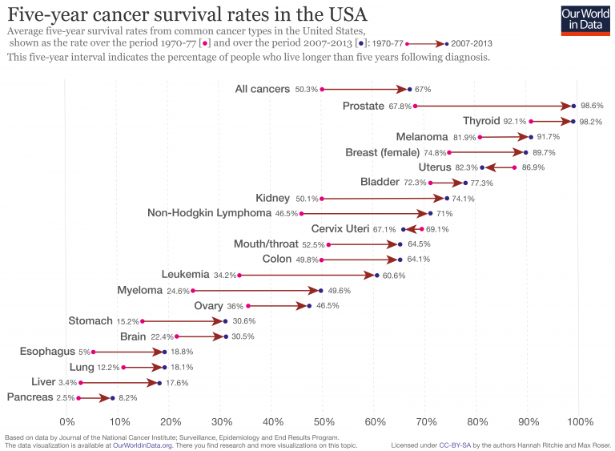

# 2018/W41: Five Year Cancer Survival Rates in America

**Data (data.world):** [https://data.world/makeovermonday/2018w40-five-year-cancer-survival-rates-in-america](https://data.world/makeovermonday/2018w40-five-year-cancer-survival-rates-in-america)

**Article / original viz:** [https://ourworldindata.org/cancer](https://ourworldindata.org/cancer)

**Dataset:** `makeovermonday/2018w40-five-year-cancer-survival-rates-in-america`  
**Last updated on data.world:** 2018-10-07T14:24:58.347Z

---

Five Year Cancer Survival Rates in America

# **Original Visualization**

# **About this Dataset**
SOURCE: [Our World in Data](https://ourworldindata.org/cancer#are-death-rates-from-cancer-rising)

# **Objectives**
* What works and what doesn't work with this chart? 
* How can you make it better? 
* Post your alternative on the discussions page.