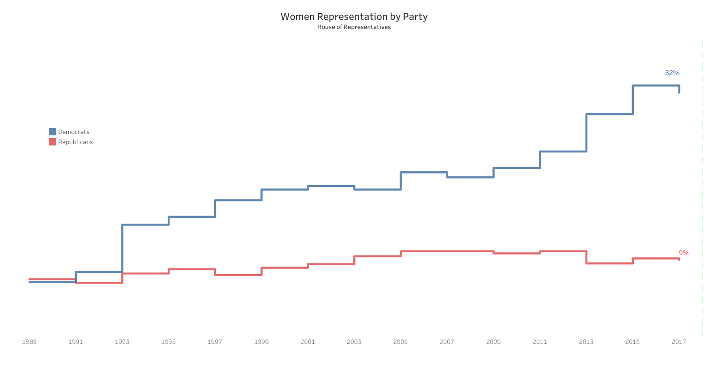

# 2018/W42: Total Number of Women the House of Representatives

**Data (data.world):** [https://data.world/makeovermonday/2018w42-total-number-of-women-the-house-of-representatives](https://data.world/makeovermonday/2018w42-total-number-of-women-the-house-of-representatives)

**Article / original viz:** [https://twitter.com/Spelk24/status/1049054474411675658](https://twitter.com/Spelk24/status/1049054474411675658)

**Original data source:** [https://public.tableau.com/profile/stephen.pelkofer#!/vizhome/WomenRepresentationintheHouseHistory/PartyDifferences-Mobile](https://public.tableau.com/profile/stephen.pelkofer#!/vizhome/WomenRepresentationintheHouseHistory/PartyDifferences-Mobile)

**Dataset:** `makeovermonday/2018w42-total-number-of-women-the-house-of-representatives`  
**Last updated on data.world:** 2018-10-14T05:54:56.176Z

---

Total Number of Women the House of Representatives 1917-2018

# **Original Visualization**

# **About this Dataset**
ORIGINAL VISUALIZATION: [Stephen Pelkofer](https://public.tableau.com/profile/stephen.pelkofer#!/vizhome/WomenRepresentationintheHouseHistory/PartyDifferences-Mobile) | [Tweet](https://twitter.com/Spelk24/status/1049054474411675658)

SOURCE: [Congressional Research Service](https://fas.org/sgp/crs/misc/RL30261.pdf)

# **Objectives**

* What works and what doesn't work with this chart? 
* How can you make it better? 
* Post your alternative on the discussions page.