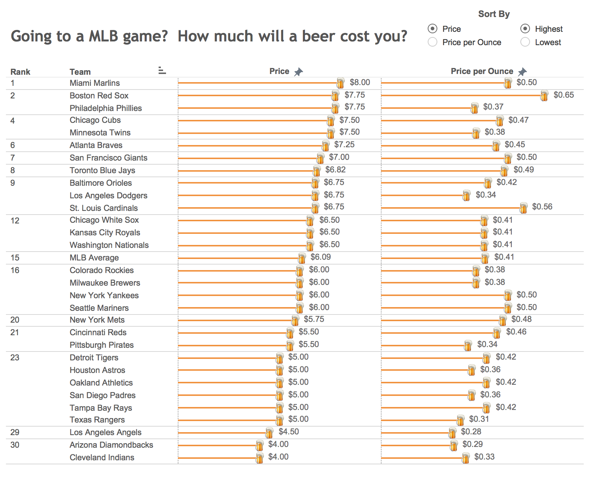

# 2018/W43: The cost of a beer at MLB stadiums

**Data (data.world):** [https://data.world/makeovermonday/2018w43-what-will-a-beer-cost-you-at-every-major-league-ba](https://data.world/makeovermonday/2018w43-what-will-a-beer-cost-you-at-every-major-league-ba)

**Article / original viz:** [https://www.vizwiz.com/2014/04/makeover-monday-what-beer-will-cost-you.html](https://www.vizwiz.com/2014/04/makeover-monday-what-beer-will-cost-you.html)

**Dataset:** `makeovermonday/2018w43-what-will-a-beer-cost-you-at-every-major-league-ba`  
**Last updated on data.world:** 2018-10-22T18:45:23.573Z

---

What will a beer cost you at every Major League Baseball stadium?

# **Original Visualization**

# **About this Dataset**
* ORIGINAL VISUALIZATION: [VizWiz](https://www.vizwiz.com/2014/04/makeover-monday-what-beer-will-cost-you.html)
* SOURCE: [Team Marketing Report](https://www.teammarketing.com/)

# **Objectives**
* What works and what doesn't work with this chart? 
* How can you make it better? 
* Post your alternative on the discussions page.