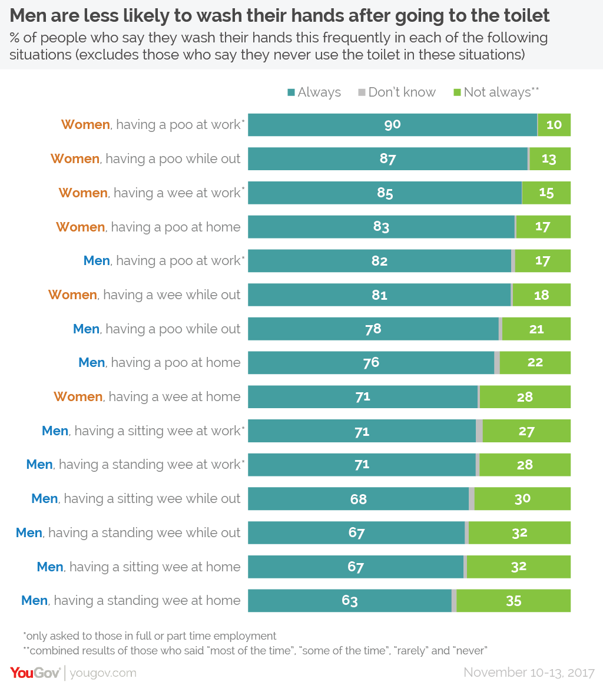

# 2018/W44: Everybody poops

**Data (data.world):** [https://data.world/makeovermonday/2018w44-everybody-poops](https://data.world/makeovermonday/2018w44-everybody-poops)

**Article / original viz:** [https://yougov.co.uk/news/2018/09/18/one-six-male-workers-say-they-dont-always-wash-the/](https://yougov.co.uk/news/2018/09/18/one-six-male-workers-say-they-dont-always-wash-the/)

**Dataset:** `makeovermonday/2018w44-everybody-poops`  
**Last updated on data.world:** 2018-10-28T17:07:35.074Z

---

Everybody poops – but one in ten women won’t do it at work or while out and about

# **Original Visualization**

# **About this Dataset**
SOURCE: [Article](https://yougov.co.uk/news/2018/09/18/one-six-male-workers-say-they-dont-always-wash-the/) 

DATA FROM: [YouGov](https://d25d2506sfb94s.cloudfront.net/cumulus_uploads/document/yifb4ww12p/YouGov%20washing%20hands.pdf)

# **Objectives**

* What works and what doesn't work with this chart? 
* How can you make it better? 
* Post your alternative on the discussions page.