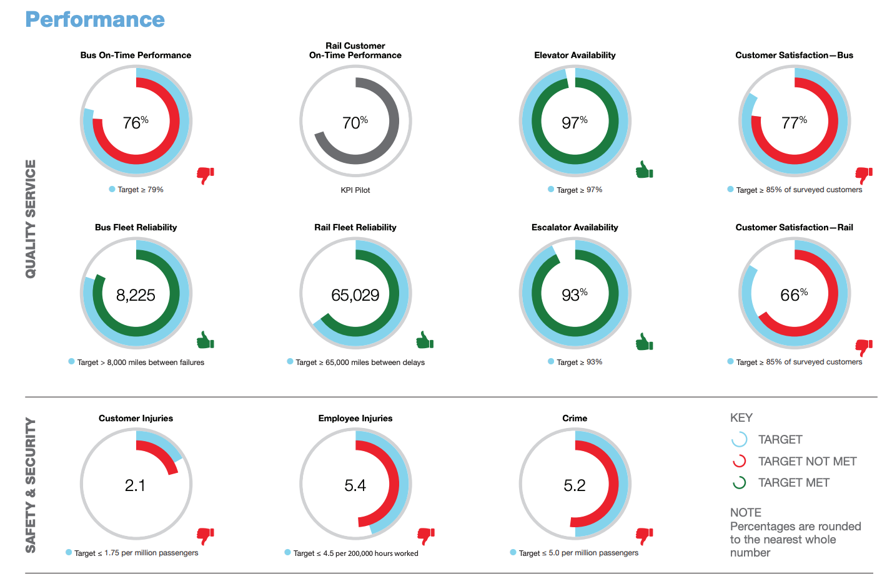

# 2016/W51: DC Metro Scorecard

**Data (data.world):** [https://data.world/makeovermonday/2016w51](https://data.world/makeovermonday/2016w51)

**Article / original viz:** [https://www.wmata.com/about/records/scorecard/upload/Vital-Signs_Report_2016-Q4_030117.pdf](https://www.wmata.com/about/records/scorecard/upload/Vital-Signs_Report_2016-Q4_030117.pdf)

**Dataset:** `makeovermonday/2016w51`  
**Last updated on data.world:** 2018-11-08T18:12:30.300Z

---

DC Metro Scorecard

# **Original Visualization**

# **About this Dataset**
* SOURCE: [Washington D.C. Metro](https://www.wmata.com/about/records/scorecard/upload/Vital-Signs_Report_2016-Q4_030117.pdf)

# **Objectives**
* What works and what doesn't work with this chart? 
* How can you make it better? 
* Post your alternative on the discussions page.