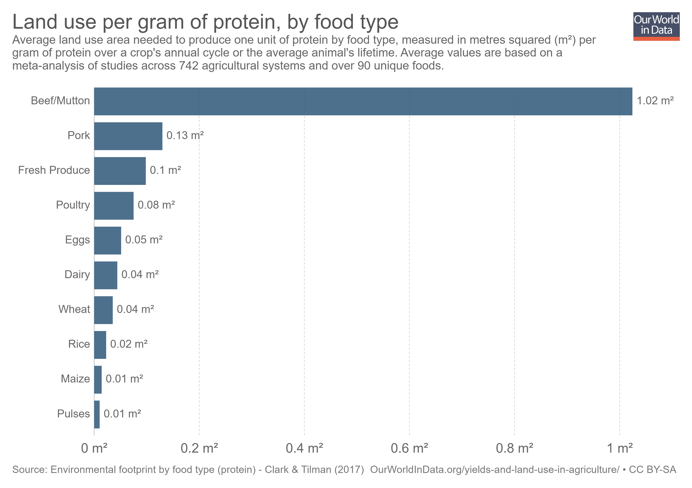

# 2018/W50: Land use by food type

**Data (data.world):** [https://data.world/makeovermonday/2018w50](https://data.world/makeovermonday/2018w50)

**Article / original viz:** [https://ourworldindata.org/yields-and-land-use-in-agriculture](https://ourworldindata.org/yields-and-land-use-in-agriculture)

**Dataset:** `makeovermonday/2018w50`  
**Last updated on data.world:** 2018-12-09T08:17:03.140Z

---

Land use by food type

# **Original Visualization**

# **About this Dataset**
SOURCE: [Our World in Data](https://ourworldindata.org/yields-and-land-use-in-agriculture#land-use-by-food-type)

FULL ARTICLE: [IOP Science](http://iopscience.iop.org/article/10.1088/1748-9326/aa6cd5)

DATA SOURCE: [Our World in Data](https://ourworldindata.org/700a146d-726a-489c-9fd0-94b6b481f523)

# **Objectives**

* What works and what doesn't work with this chart? 
* How can you make it better? 
* Post your alternative on the discussions page.