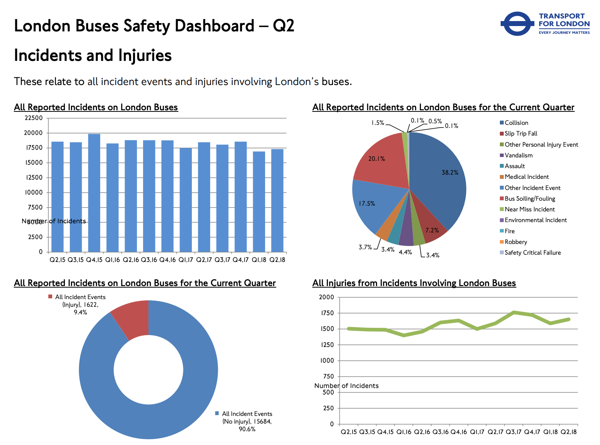

# 2018/W51: London Bus Safety Performance

**Data (data.world):** [https://data.world/makeovermonday/2018w51](https://data.world/makeovermonday/2018w51)

**Article / original viz:** [http://content.tfl.gov.uk/q2-18-london-bus-safety-dashboard.pdf](http://content.tfl.gov.uk/q2-18-london-bus-safety-dashboard.pdf)

**Dataset:** `makeovermonday/2018w51`  
**Last updated on data.world:** 2019-01-18T09:47:48.869Z

---

Transport for London produces quarterly reports that provide analysis of incidents on the London bus network

# **Original Visualization**

# **About this Dataset**
DATA SOURCE: [Transport for London](https://tfl.gov.uk/corporate/publications-and-reports/bus-safety-data)

DASHBOARD: [London Buses Safety Dashboard – Q2](https://tfl.gov.uk/cdn/static/cms/documents/q2-18-london-bus-safety-dashboard.pdf)

# **Objectives**
* What works and what doesn't work with this chart? 
* How can you make it better? 
* Post your alternative on the discussions page.