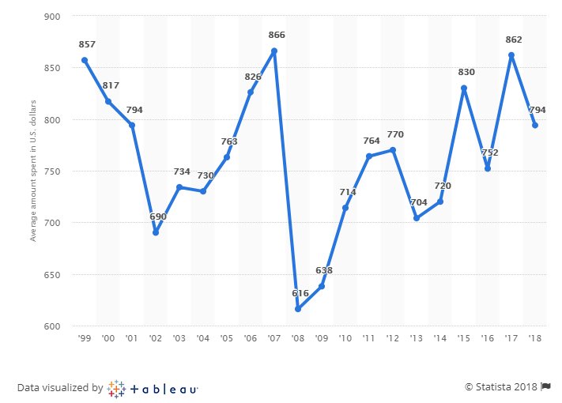

# 2018/W52: Average spending on Christmas gifts in the U.S.

**Data (data.world):** [https://data.world/makeovermonday/2018w52](https://data.world/makeovermonday/2018w52)

**Article / original viz:** [https://www.statista.com/statistics/246963/christmas-spending-in-the-us-during-november/](https://www.statista.com/statistics/246963/christmas-spending-in-the-us-during-november/)

**Dataset:** `makeovermonday/2018w52`  
**Last updated on data.world:** 2018-12-23T12:57:36.091Z

---

Average spending on Christmas gifts in the U.S. 1999-2018

# **Original Visualization**

# **About this Dataset**
SOURCE: [Statista](https://www.statista.com/statistics/246963/christmas-spending-in-the-us-during-november/)

# **Objectives**

* What works and what doesn't work with this chart? 
* How can you make it better? 
* Post your alternative on the discussions page.