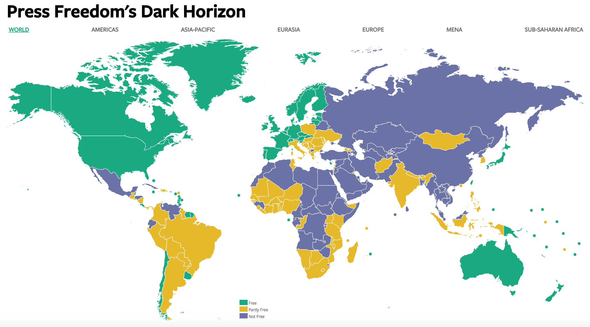

# 2019/W2: Press Freedom's Dark Horizon

**Data (data.world):** [https://data.world/makeovermonday/2019w2](https://data.world/makeovermonday/2019w2)

**Article / original viz:** [https://freedomhouse.org/report/freedom-press/freedom-press-2017](https://freedomhouse.org/report/freedom-press/freedom-press-2017)

**Dataset:** `makeovermonday/2019w2`  
**Last updated on data.world:** 2019-01-06T12:15:00.123Z

---

How free is press around the world?

# **Original Visualization**

# **About this Dataset**
ARTICLE: [Freedom House](https://freedomhouse.org/report/freedom-press/freedom-press-2017)

DATA SOURCE: [Freedom House](https://freedomhouse.org/sites/default/files/FOTP1980-FOTP2017_Public-Data.xlsx)

# **Objectives**

* What works and what doesn't work with this chart? 
* How can you make it better? 

Under the edit window, click on *Preview* to see what your post will look like. You can also edit your post later on (instead of posting a new comment)