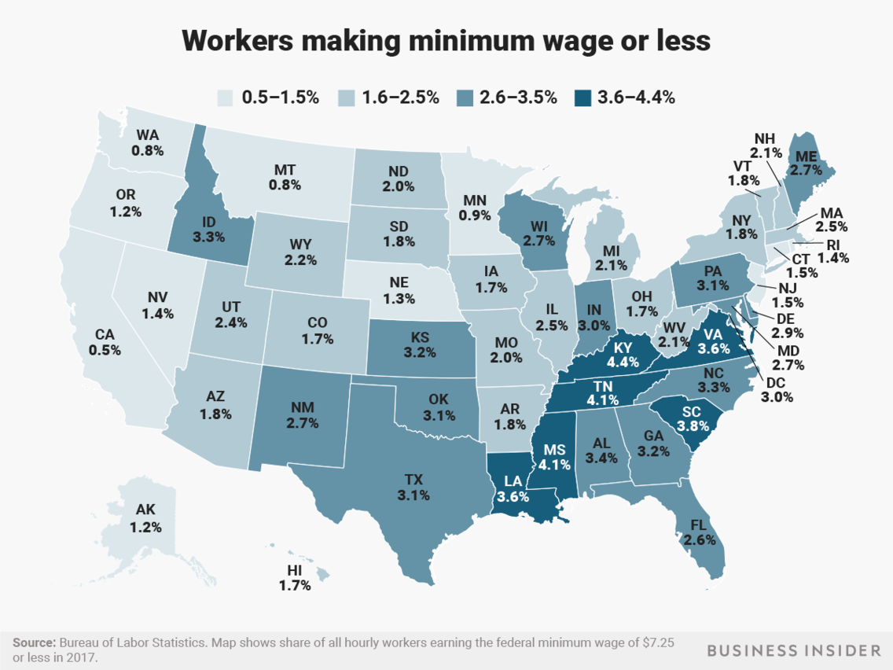

# 2019/W3: How many people earned the Federal minimum wage?

**Data (data.world):** [https://data.world/makeovermonday/2019w3](https://data.world/makeovermonday/2019w3)

**Article / original viz:** [https://www.businessinsider.com/federal-minimum-wage-workers-map-2018-10?r=US&IR=T](https://www.businessinsider.com/federal-minimum-wage-workers-map-2018-10?r=US&IR=T)

**Dataset:** `makeovermonday/2019w3`  
**Last updated on data.world:** 2019-01-13T17:28:17.998Z

---

According to the Bureau of Labor Statistics, how many people earned the Federal minimum wage or less in each State?

# **Original Visualization**

# **About this Dataset**
ARTICLE: [Business Insider](https://www.businessinsider.com/federal-minimum-wage-workers-map-2018-10?r=US&IR=T)

SOURCE: [Bureau of Labor Statistics](https://www.bls.gov/opub/reports/minimum-wage/2017/home.htm)

# **Objectives**

* What works and what doesn't work with this chart? 
* How can you make it better?