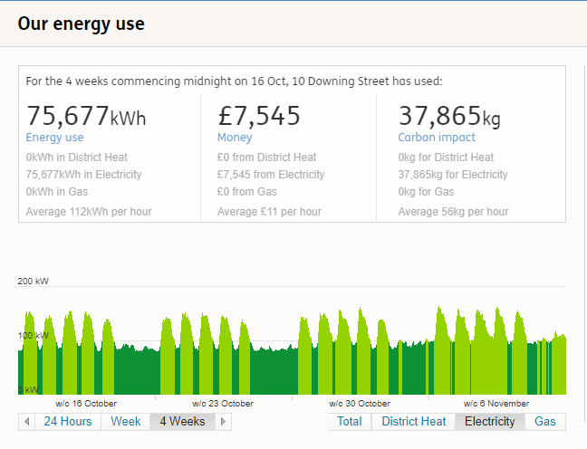

# 2019/W4: Energy Use at 10 Downing St in 2017

**Data (data.world):** [https://data.world/makeovermonday/2019w4](https://data.world/makeovermonday/2019w4)

**Article / original viz:** [https://platform.carbonculture.net/places/10-downing-street/9/](https://platform.carbonculture.net/places/10-downing-street/9/)

**Dataset:** `makeovermonday/2019w4`  
**Last updated on data.world:** 2019-01-20T12:52:29.440Z

---

Energy Use at 10 Downing St in 2017

# **Original Visualization**

# **About this Dataset**
SOURCE: [Carbon Culture](https://platform.carbonculture.net/places/10-downing-street/9/)

DATA: [Carbon Culture](https://platform.carbonculture.net/apps/studydata/data-download?year=2017&id=9&subject=places)

# **Objectives**

* What works and what doesn't work with this chart? 
* How can you make it better?