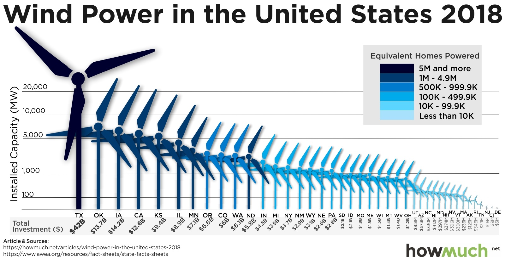

# W8/2019: Which States Produce the Most Wind Energy

**Data (data.world):** [https://data.world/makeovermonday/2019w8](https://data.world/makeovermonday/2019w8)

**Article / original viz:** [https://howmuch.net/articles/wind-power-in-the-united-states-2018](https://howmuch.net/articles/wind-power-in-the-united-states-2018)

**Dataset:** `makeovermonday/2019w8`  
**Last updated on data.world:** 2019-02-17T11:18:21.910Z

---

Which States Produce the Most Wind Energy

# **Original Visualization**

# **About this Dataset**
ARTICLE: [Howmuch.net](https://howmuch.net/articles/wind-power-in-the-united-states-2018)

SOURCE: [American Wind Energy Association via ChooseEnergy.com](https://www.chooseenergy.com/news/article/best-worst-ranked-states-wind-power/)

# **Objectives**

* What works and what doesn't work with this chart? 
* How can you make it better?