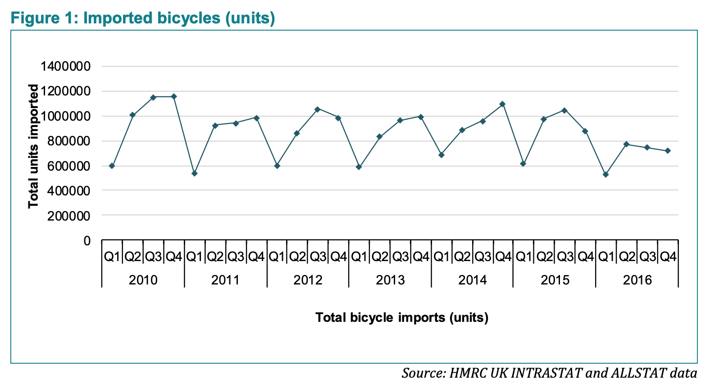

# 2019/W9: Economic value of the bicycle industry

**Data (data.world):** [https://data.world/makeovermonday/2019w11](https://data.world/makeovermonday/2019w11)

**Article / original viz:** [http://www.sqw.co.uk/files/6914/9406/9034/SQW_Economic_value_of_the_bicycle_industry_and_cycling_March_2017_FINAL.pdf](http://www.sqw.co.uk/files/6914/9406/9034/SQW_Economic_value_of_the_bicycle_industry_and_cycling_March_2017_FINAL.pdf)

**Dataset:** `makeovermonday/2019w11`  
**Last updated on data.world:** 2019-02-24T16:06:49.918Z

---

# **Original Visualization**

# **About this Dataset**
SOURCE: [SQW](http://www.sqw.co.uk/files/6914/9406/9034/SQW_Economic_value_of_the_bicycle_industry_and_cycling_March_2017_FINAL.pdf)

# **Objectives**

* What works and what doesn't work with this chart? 
* How can you make it better?