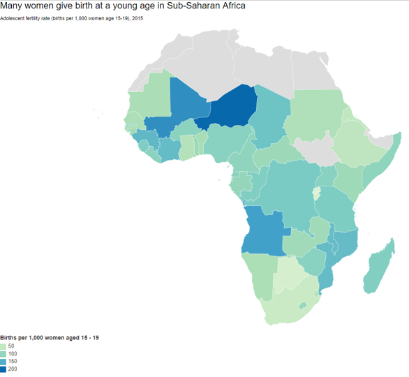

# 2019/W10: World Development Indicators - Health and Equality

**Data (data.world):** [https://data.world/makeovermonday/2019w10](https://data.world/makeovermonday/2019w10)

**Article / original viz:** [https://datawrapper.dwcdn.net/nU5Gj/1/](https://datawrapper.dwcdn.net/nU5Gj/1/)

**Dataset:** `makeovermonday/2019w10`  
**Last updated on data.world:** 2019-03-07T07:02:55.836Z

---

World Development Indicators - Health and Equality

# **Original Visualization**

[Interactive Visualization](https://datawrapper.dwcdn.net/nU5Gj/1/)

# **About this Dataset**
DATA SOURCE: [The World Bank](https://datacatalog.worldbank.org/dataset/world-development-indicators)
COLLABORATION WITH: Operation Fistula (please tag **@opfistula** on Twitter)
DATA DICTIONARY and BACKGROUND INFORMATION: please see pdf in the attachments section

# **Style Guidelines**
You are welcome to use the below guidelines provided by Operation Fistula when designing your work:
- Font: Avenir
- Colors:
     - Orange (R - 203 | G - 97 | B - 97)
     - Dark Grey (R - 26| G - 25 | B - 25)
     - Light Orange (R - 250| G - 234 | B - 219)
- Logo Files: Please see attachments
- Picture Files: Please see attachments. you **MUST** include picture credit to www.opfistula.org

# **Objectives**

* What works and what doesn't work with this chart? 
* How can you make it better?