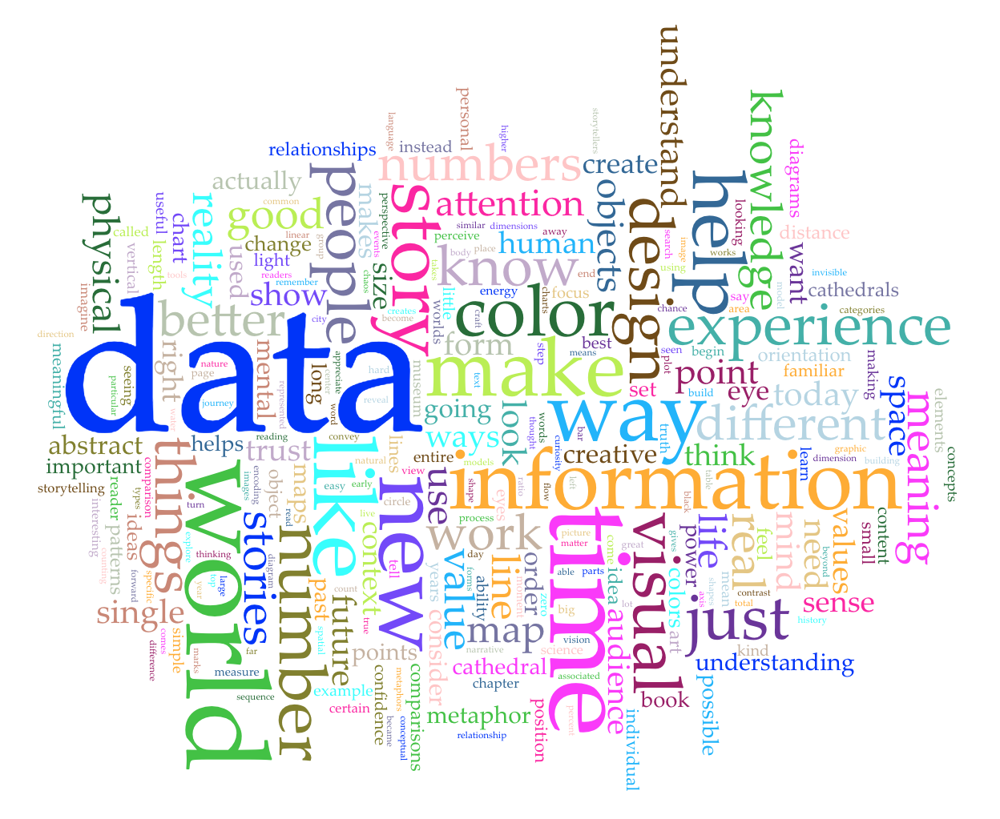

# 2019/W16: The words in 'Info We Trust'

**Data (data.world):** [https://data.world/makeovermonday/2019w16](https://data.world/makeovermonday/2019w16)

**Article / original viz:** [https://infowetrust.com/inspire/](https://infowetrust.com/inspire/)

**Dataset:** `makeovermonday/2019w16`  
**Last updated on data.world:** 2019-04-20T13:33:41.275Z

---

The words in  RJ Andrew's book 'Info We Trust'

# **Original Visualization**

# **About this Dataset**
DATA SOURCE: [RJ Andrews (direct)](https://infowetrust.com/inspire/)

# **Objectives**

* What works and what doesn't work with this chart? 
* How can you make it better?