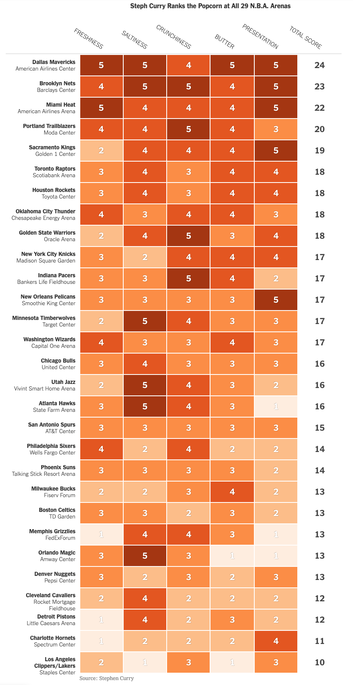

# 2019/W17: Stephen Curry's Stadium Popcorn Rankings

**Data (data.world):** [https://data.world/makeovermonday/2019w17](https://data.world/makeovermonday/2019w17)

**Article / original viz:** [https://www.nytimes.com/interactive/2019/04/12/sports/basketball/stephen-curry-warriors-popcorn.html](https://www.nytimes.com/interactive/2019/04/12/sports/basketball/stephen-curry-warriors-popcorn.html)

**Dataset:** `makeovermonday/2019w17`  
**Last updated on data.world:** 2019-04-21T09:41:42.930Z

---

Which NBA stadium has Stephen Curry's favorite popcorn?

# **Original Visualization**

# **About this Dataset**
SOURCE: [New York Times](https://www.nytimes.com/interactive/2019/04/12/sports/basketball/stephen-curry-warriors-popcorn.html)
DATA SOURCE: [Stephen Curry](https://twitter.com/StephenCurry30)

# **Objectives**

* What works and what doesn't work with this chart?
* How can you make it better?