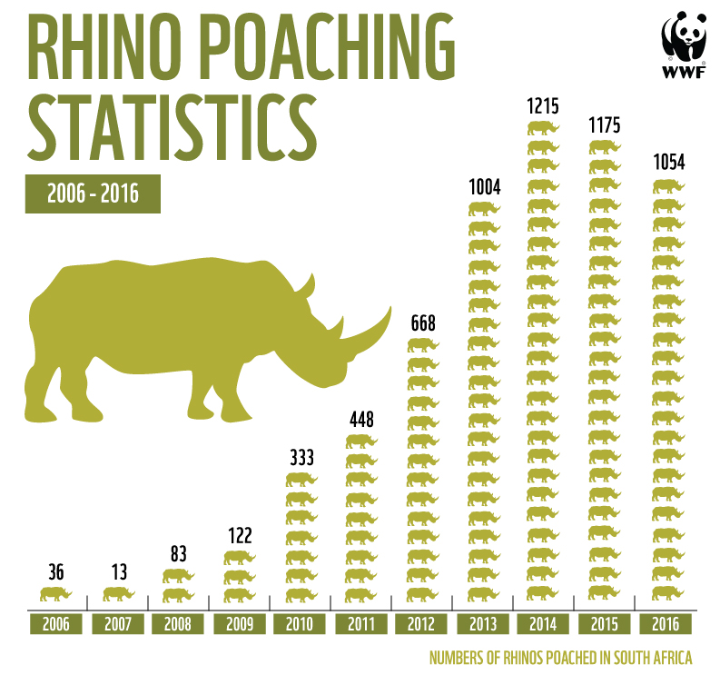

# 2019/W20: Rhino poaching in South Africa 2006-2016

**Data (data.world):** [https://data.world/makeovermonday/2019w20](https://data.world/makeovermonday/2019w20)

**Article / original viz:** [https://lowvelder.co.za/376918/antipoaching-figures-look-better-still-losing-three-rhinos-day/](https://lowvelder.co.za/376918/antipoaching-figures-look-better-still-losing-three-rhinos-day/)

**Dataset:** `makeovermonday/2019w20`  
**Last updated on data.world:** 2019-05-12T14:37:00.103Z

---

Rhino poaching in South Africa 2006-2016

# **Original Visualization**

# **About this Dataset**
SOURCE ARTICLE: [Rhino poaching figures look better but we are still losing three rhinos a day](https://lowvelder.co.za/376918/antipoaching-figures-look-better-still-losing-three-rhinos-day/)

# **Objectives**

* What works and what doesn't work with this chart? 
* How can you make it better?