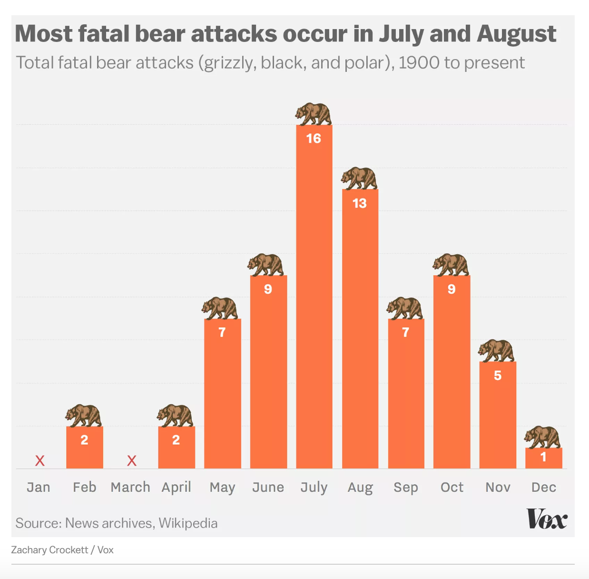

# 2019/W21: When are you most likely to be killed by a bear?

**Data (data.world):** [https://data.world/makeovermonday/2019w21](https://data.world/makeovermonday/2019w21)

**Article / original viz:** [https://www.vox.com/2016/10/6/13170344/bear-attacks-national-state-parks](https://www.vox.com/2016/10/6/13170344/bear-attacks-national-state-parks)

**Dataset:** `makeovermonday/2019w21`  
**Last updated on data.world:** 2019-05-19T10:08:40.867Z

---

In which park and when, are you most likely to be killed by a bear?

**NOTE:** The data was collected, prepared, and distributed by [Ali Sanne](https://data.world/ajsanne) on [data.world](https://data.world/ajsanne/north-america-bear-killings). Please reference her in your visualizations.

# ​**Original Visualization**

​

# **About this Dataset**
SOURCE ARTICLE: [Vox](https://www.vox.com/2016/10/6/13170344/bear-attacks-national-state-parks)
DATA SOURCE: [Wikipedia](https://en.wikipedia.org/wiki/List_of_fatal_bear_attacks_in_North_America)

​

# **Objectives**

* What works and what doesn't work with this chart?
* How can you make it better?